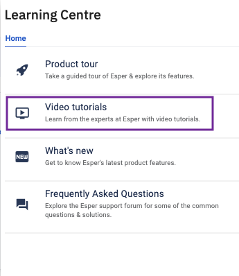
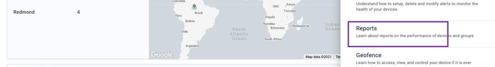
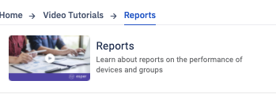
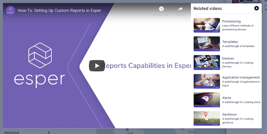

## How to Access the Product Video Tutorials From the Learning Centre?

  

Step 1: Go to the Learning Center and choose the video tutorials option from the slide-out.

  

  

Step 2: You will get video tutorials categories. Choose the one which you wish to learn more about.

  

Step 3: You can pick a video from the set of videos available in that category.

  

Step 4: You can watch the tutorial on a video play window. Close the window once you are done.

  

