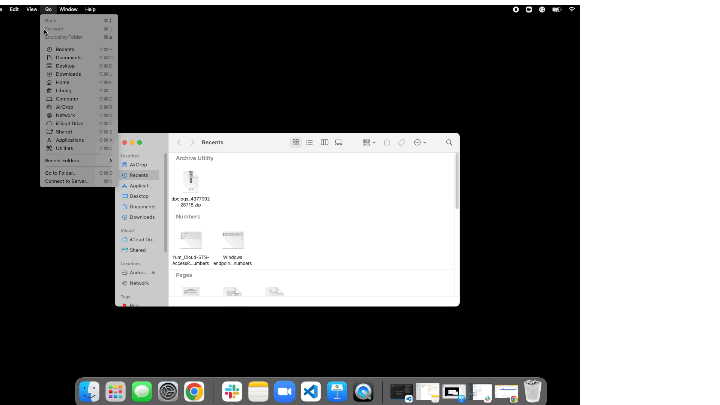

# How to Install the ADB Tool 


Android Debug Bridge (ADB) is a command line tool that lets you communicate with a device, enabling you to access certain features of the Android platform that are not otherwise accessible. To set up a device with Esper Foundation for Android (EFA), you must send commands to the device — requiring you to install the ADB tool on your computer, be it Windows or macOS. Windows devices do not have ADB drivers installed. These drivers are required to detect the device when using the Esper Device Provisioner Tool on a Windows machine. Mac devices come with ADB drivers, but we recommend installing the tool.

## Installing ADB on Windows

  

1.  Download and install the [latest Android Studio release](https://developer.android.com/studio/?gclid=Cj0KCQjwlK-WBhDjARIsAO2sErQ3FhMhdHO-0UKUBK95BreC4H75i8aO59QfJ6YVUe7DxqC2YPVj59gaAo2JEALw_wcB&gclsrc=aw.ds).
    
2.  Once installed, click the “More Actions” button, and select “SDK Manager” from the drop-down.
    


3.  In the SDK manager, click “SDK Tools” and select the following for installation:
    

1.  Android SDK Command-Line tools
    
2.  Android SDK Platform-Tools
    
3.  Google USB Driver
    


4.  Once installed, you need to set the platform-tools file into the path.
    

1.  In your search bar, type environment and click “Edit the system environment variables”.
    
2.  Click “Environment Variables”.
    
3.  Under “User variables,” click “New”.
    
4.  Set the variable name to “Android”.
    
5.  For the variable value, you need to find where your platform tools are located on your hard drive. In general, when installed with Android Studio, it will live here: C:\Users\ {Your username}\AppData\Local\Android\Sdk\platform-tools
    

**Note:** You need to turn on the view hidden files function to access app data.

6.  Once you have verified the location of your platform tools, click “OK”.
    

5.  Now, you need to verify the path is working correctly:
    

Run command line > Windows key + R > cmd > enter

6.  Type “adb devices”, and then press enter. If pathed correctly, you will get the below response, and the system is ready to start the ADB commands.
    


## Installing ADB on Mac

1.  Download the latest [SDK Platform-tools.zip file](https://dl.google.com/android/repository/platform-tools-latest-darwin.zip).
    
2.  Extract the .zip file using Mac's default Archive Utility app. You'll have a new folder called 'platform-tools' on your default download path.
    
3.  Now, click the “Go”option on the Finder and select Utilities.
    
4.  You'll find Terminal among the list of Mac Utilities. Double-click it to launch the Terminal.
    

<!-- 5.  When the Terminal is launched, click the 'platform-tools' folder icon, hold the Command button and drag it to the Terminal window.


    

Alternatively, you can type the path of the ‘platform-tools‘ folder and press enter.

Example: cd /Users/username/Desktop/platform-tools

 -->

6.  This will change directory (cd) and set the Terminal's path to the folder with the ADB and Fastboot files.
    

You are all set to run ADB commands in the Mac Terminal. To verify that you have done everything correctly, type the following command and press enter.

```
./adb
``` 

