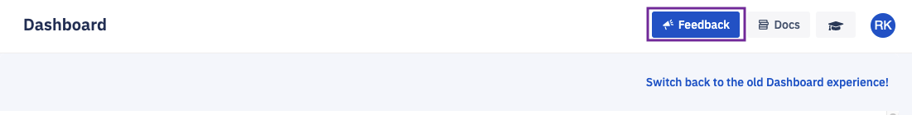
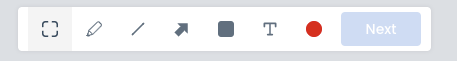
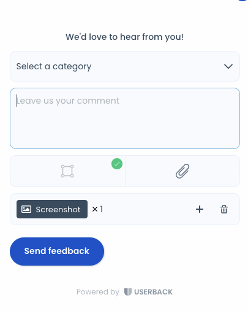

## What is the Feedback widget?

No matter where you are in the Console, clicking the blue **Feedback** button at the top right corner of the Console will allow you to share detailed feedback with the Esper engineering team. Clicking Feedback also allows you to report any issues you may encounter while using Esper Console without leaving the screen.

  

Clicking Feedback brings up a screen with the following tools:

Box tool – Highlight a specific area of the page and comment on that area. If you prefer not to leave a comment, simply leave the box outline highlighting the Console area you would like to draw attention to.

Blackout tool – Blackout any sensitive information on the screen.

Pen tool – Draw anything you like! Circle and Point work great with a touch screen and pen.

Line tool – Underline, strikethrough, draw a straight line.

Line with arrow tool – Point to something.

Comment tool – Drop a pin and make a comment.

  

Once you have selected the area you want to submit your feedback, click on the Next button to the right of the toolbar. This will bring up a pop-up box that will enable you to select a feedback category and fill in your comments.

  

  

To submit your feedback or comment, click '**Send Feedback**.' Your feedback will go directly to Esper’s engineering team, who will then add it to our feature and issue tracking system.