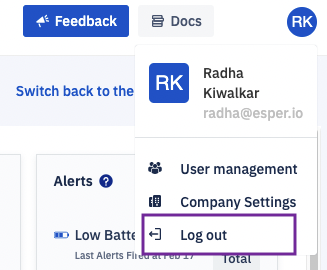

## How to Logout From Esper?

Click on the user profile icon at the top right of the console. Select the ‘Log out’ option from the drop-down.

  

**Note**: The USer profile is a static component for the console. It can be accessed from all the console screens.

  

