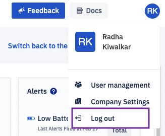

## How to Logout From the Esper Console?

Click on the user profile icon at the top right of the Console. Select the ‘Log out’ option from the drop-down.

  

:::tip
The User profile is a static component for the Console. It can be accessed from all the Console screens.
:::

  

