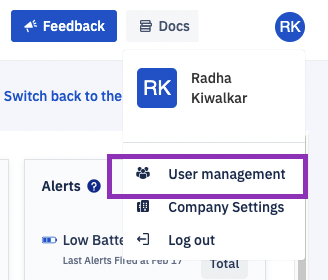
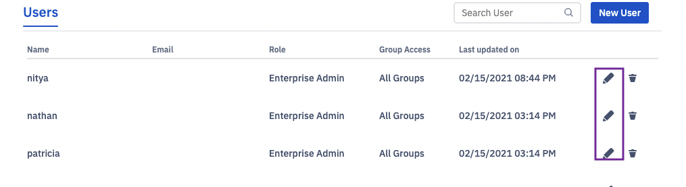

## How to Change Your Password?

  

Step 1: Click on the ‘User Profile’ icon at the top right of the console screen.

  

Step 2: Choose the ‘User management’ option from the drop-down.Click on the edit pencil icon.

  

  

Step 3: Click on the ‘Change password’ link to edit the password. Click on **Next** once you have made the necessary changes. Clicking on **Cancel** will take you back to the ‘User Management’ screen.

  

  

Step 4: Preview the user’s role and click on **Confirm** to commit the changes. Clicking on the Back button will take you to step1 where you can edit the information. Clicking **Cancel** will take you back to the ‘User management’ screen.

