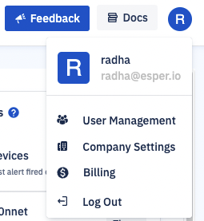
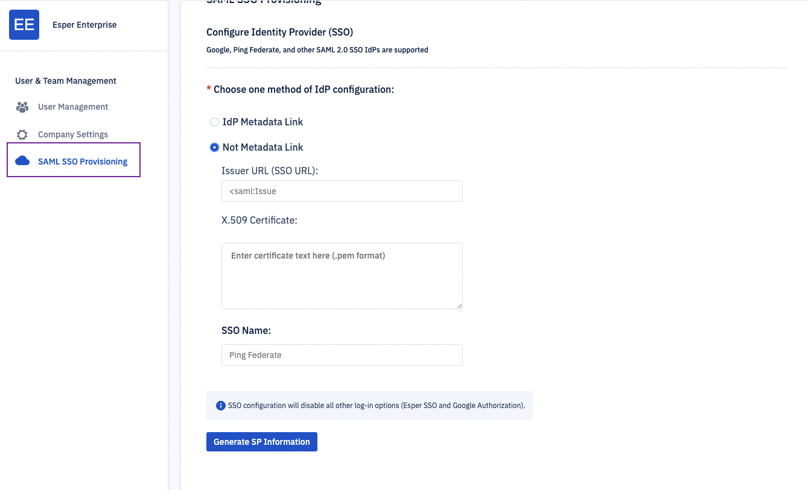
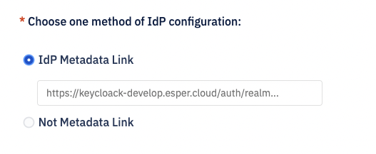
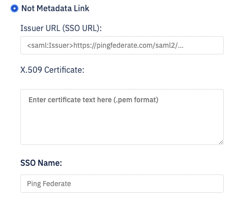
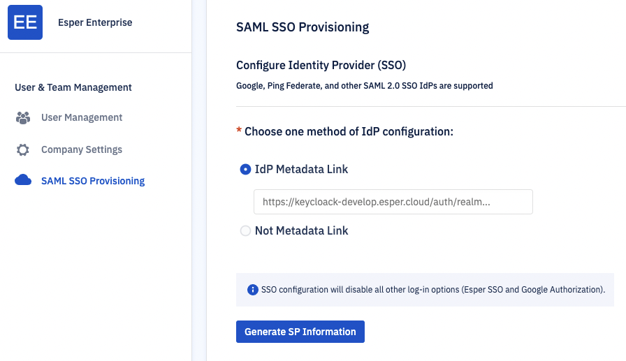
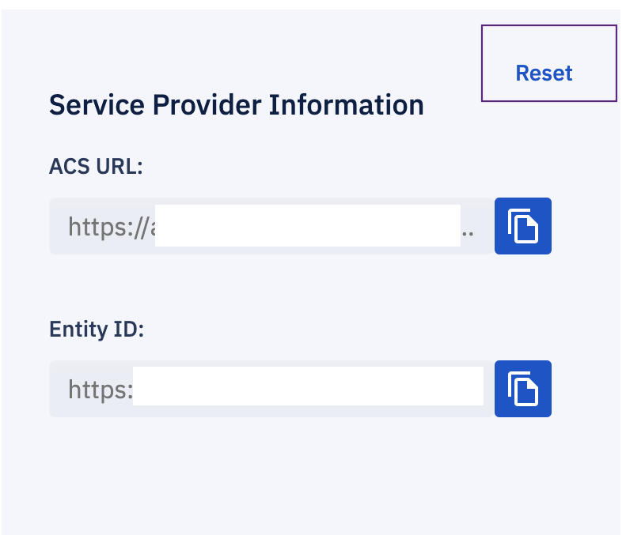

# How to configure SAML SSO?

:::warning
On free Esper plan, this feature is not available by default. If you need this capability, reach out to [Esper](https://support.esper.io/s/) to upgrade your plan to Esper Architect.
:::  

Click the Profile icon and navigate to your company settings.

  

  

1.  Click “SAML SSO Configuration” located within the User & Team management Pane.
    

  
:::tip
Only Enterprise Administrators are allowed to configure SAML SSO.
:::
  

2.  Input your IdP information
    

     If you have your IdP Metadata Link readily available, insert it into the appropriate field.
    
    
  

    If you do not have your IdP Metadata link, manually add your Issuer URL, X.509 certificate, and name of your SSO provider (such as PingFederate, Okta, etc.)
    

  

:::tip
We support Google, Ping Federate, and other SAML 2.0 SSOs.
:::

 

3.  Click Generate SP Information. This will automatically route all users to login via your IDP provider.
    
  

 4.  Copy the generated ACS URL and Entity ID from Esper and add them to your IDP to finish configuring SAML SSO.
    
:::tip
Admin must set the Name ID Format in your IdP to Email Address.
:::

 

To disable or edit your SAML SSO configuration, click “Reset”.

