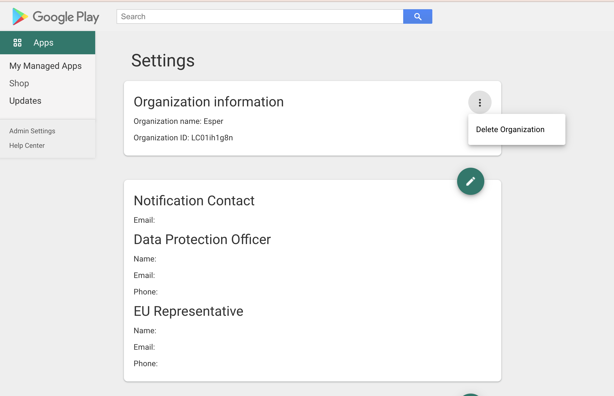

# What are Web Apps?

Web App converts a website/web page into an Android application. If your experience is via a website, you can access it in multi-app mode. But if you need to lock the device down to just your website, you can create a web app and use that application in Kiosk mode.

## What are the requirements for creating a web app?

Following are the requirements for creating a web app:

-   The device should be Google Certified (GMS Device).
    
-   On your endpoint, you must [enroll in Managed Google](../apps/appactions.md) Play.
    
-   Onboard devices with the Managed Google Play enabled in the blueprint.
    
-   The devices must have Chrome installed and state set to “Show” state. We recommend that you upload Chrome via a blueprint and select the app state to “Show.” You can set the state to “Hide” after accepting terms of service, but “Disabled” cannot be the app state.
    

-   If Chrome is preloaded on the device (most likely), adding the app via package name com.android.chrome is recommended instead of installing a new one during onboarding.
    

:::tip
Chrome must always be in the “Show” state for unsecured HTTP web apps.
:::

## How to create a web app?

1.  Create and/or log into your endpoint (https://{endpoint}.esper.cloud/app-management/play-store). If not already enrolled, make sure you enroll in a Managed Google Play Account.
    
2.  Navigate to the “Apps” section of the Console. Under the Play Store, select the web app.
    

  

  
  

3.  Click on “Web apps” and the “+” button in the bottom right of the Managed Play Store.
    

  

4.  Fill out the information.
    

    a.  The name of the web app will appear on the app icon and in Esper Console.
    
    b.  URL destination
    
    c.  Display mode when the app opens
    
    d.  Upload app icon (optional)
    
    e.  Default icon
    

  

5.  The app creation in the Managed Play Store should take no more than a few minutes. This app should automatically be “Approved” for the enterprise.
    
6.  Search for the app in the Esper Console. Package names are com.google.enterprise.webapp.{identifier}
    

## How to edit the web app?

You can edit a web app in the Play Store. View the app and click “edit” to change any information.

The app name and icon changes will not reflect immediately if the web app is installed on the device. The URL and UI changes are dynamic and reflect on the device after a few minutes. Restarting a device will force it to update the app name and icon.

Like creation, changes within the Esper Console are reflected after some time, but this will not interfere with any app functionality.

  

## Troubleshooting

If you are unable to install a web app or the app is not found in the app list, try the following:

1. Un-approve and re-approve the app. Now check the app list in the Device & Groups section; if the app is not available in the default app list, use the search bar to search the app.

2. If the app is still not available in the search, use "Enterprise Id" to search the Google Play Store and then un-approve and approve it again.

  

## FAQ

Q: What kind of account is accepted to sign into Managed Google Play?

A: The email address can be a basic Gmail account with few details. It must not be a G Suite/Google Workspace business account.

  

Q. How to remove my account from the managed play?

A. You can log in to the URL ([https://play.google.com/work/adminsettings](https://play.google.com/work/adminsettings)) with your account. Navigate to "Admin Settings” on the left menu bar and click "Delete Organization." Your endpoint will get unenrolled in an hour.

  

Q: I used the wrong email to sign in to Managed Google Play. Can I change the associated address?

A: You must contact [Esper Support](https://support.esper.io/s/) to un-enroll and re-enroll.

  

Q: I created an app following the above steps, but I cannot see my app when searching Esper Console.

A: It typically takes about 10 min for the App to show on Esper Console. Note that Google Play Store is a Google service, and Esper does not control the time taken for the app to be available.

  

Q: I cannot see the Web app on the device?

A: Make sure that Chrome is set to the “Show” or the “Hide” state on the device. It cannot be “Disabled.”

  

Q: I have a non-GMS device. Can my web app work?

A: You must contact [Esper Support](https://support.esper.io/s/) to work on non-GMS or AOSP devices for a web app.