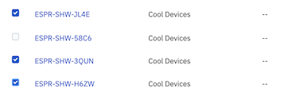
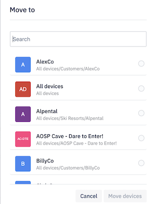

## How to Move the Devices to Another Device Group?

Esper provides an option to move devices from one group to another. You can choose the devices you wish to move and then select the destination device group.

 See detailed instructions to move devices, below:

  

Step 1: Click on the Select devices link on the top right corner to expose the selection checkbox on the devices.

  

Step 2: Click on the checkbox next to the devices you wish to move.

  

Step 3: Selecting devices will highlight the Actions button on top. Choose the ‘Move devices’ option from the dropdown menu.

  

Step 4: Select the destination device group where you want to move the selected devices. Click on **Move Devices.**

  

Your devices will be moved successfully and a success toast message will be displayed.

  

:::tip
You can also select and move devices across groups in grid-view mode.
:::