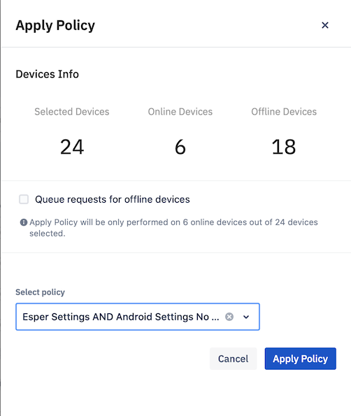

## How to Take Quick Actions on the Selected Devices?

  

The Action drop-down is available when you select a device using the ‘Select Device’ link on the right side of the ‘Device & Group’ screen. The Actions drop-down gives you a set of specific actions that can be performed on a selected device in the List View or the Grid View. It is unavailable in Map View. We support a few quick actions like Move Devices, Ping, Reboot, Application Install, Application Uninstall, Apply Policy and Remove/Factory Reset Device.

  

  

### Move devices:

  

You will use the ‘Move Devices’ option to move devices between groups. Go to **Actions** > **Move Devices**, and you can select the destination group to move the devices. Select the button on the right side of the group, then click **Move Devices**.

  

Visit  [how to move devices to another device group](./device-move.md)  for detailed instructions to move devices.

  

### Ping:

  

Esper managed devices are continuously communicating with our Cloud and updating their statuses every minute. If a device dozes off due to inactivity or a bad network connection, Esper Cloud will regularly wake the device. Clicking the **Ping** option allows you accomplish the same task manually.

  

  

### Reboot:

  

When you click the **Reboot** option, the Esper Console will send the command to reboot the active device.

  
  

  

### Application Install:

  

The Application Install quick action allows you install both privately uploaded applications—also known as Enterprise Applications—and Google Play applications on the selected devices.

  

Visit [how to install an application](./groups-apps-install-uninstall.md) for the step by step instructions on how to install an application.

  

### App Uninstall:

  

The Application Uninstall quick action lets you Uninstall both privately uploaded applications—also known as Enterprise Applications—and Google Play applications to the selected devices.

  

  

Visit [how to Uninstall an application](./groups-apps-install-uninstall.md) for detailed instructions.

### Apply Policy:

  

When you apply a compliance policy to a group, all the online devices will receive a command to comply with the policy. If you select the checkbox next to “Queue requests for offline devices,” the system will queue updates for all offline devices for the next 24 hours.

  

  

### Remove / Factory reset device:

You can remove one or more devices or groups from the Esper Dashboard. There is a checkbox for 'Factory Reset' the Devices and for 'Wipe External Storage.'

:::tip
By default, Factory Reset option will be checked. For online devices, factory reset will be enabled.
:::

  

