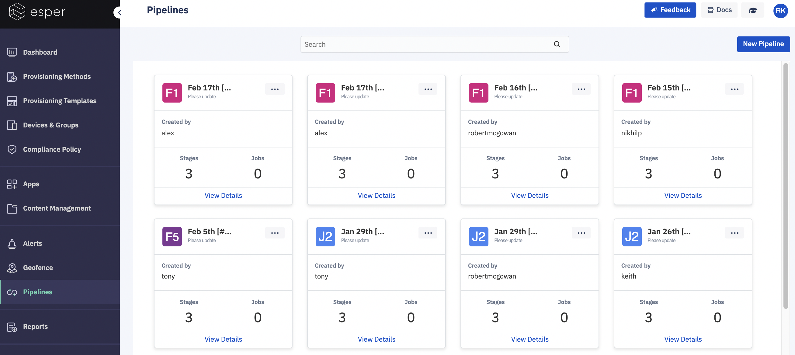

## What is a Pipeline?

Esper Pipelines enable you to ensure smooth completion of actions on large fleets of devices by providing a way to automate them. Using a pipeline you define the stages through which the actions must complete and the events that trigger each of those stages, providing an effective way to control complex or large processes.

Esper Pipelines currently supports application installation. It requires the user to manually promote to the next stage. Following are the key terms related to pipelines:

*Pipeline* - A chain of processes/functions connected in a serial manner.

*Operation* - An operation is defined as the action to be performed. Installation of an application is an operation.

*Stage* - Logical separation to perform any checks between the execution of an operation.

*Target* - Destination intended for a specific operation in each stage. For instance, if the operation is installing an application, the target is the device/list of devices the application is being installed.

*Job* - The action performed (operation) as part of a pipeline. For instance, a pipeline could have two separate jobs - for installing two different applications.

*Run* - An instance of pipeline in execution.

*Trigger* - A prompt to force the execution of a pipeline stage. This could be manual (prompted by a user) or automatic (prompted as a result of successful criteria like an online device).

**Note:** We currently suppport manual trigger.

A new pipeline (base) can be created with three default stages using the Console (You can create more than three stages via the Esper CLI). Create a new job that will indicate the operation (Application Install in this case) and corresponding application/version.

Start a new run to initiate a pipeline - the user can choose to update the application version to be installed before starting a new run. A Run can be started, paused, resumed, or terminated. 

Any pipeline can have multiple jobs created, and each job can have multiple runs (only one run active at a time) associated with it.

