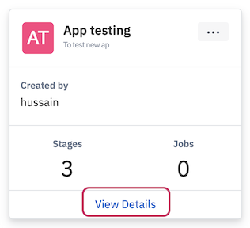
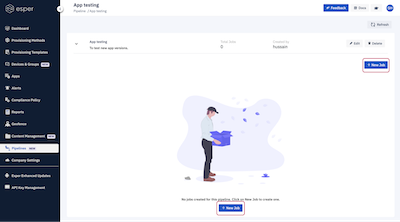
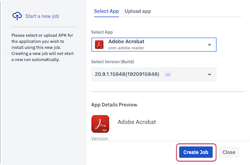
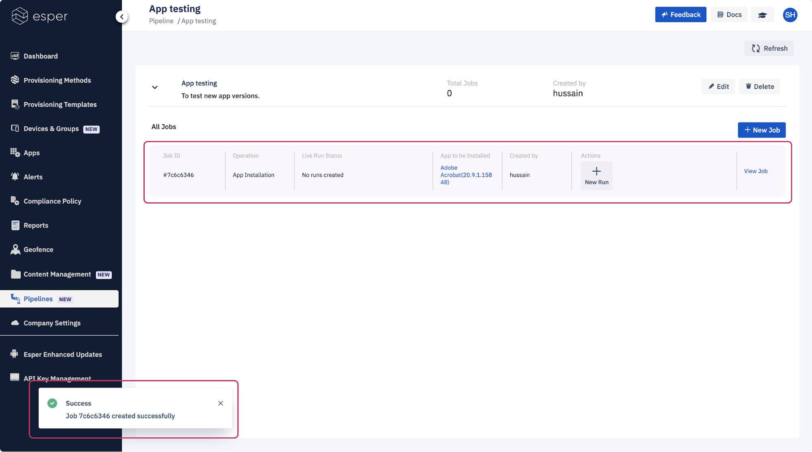

## How to Create a New Job in the Pipeline?

  

Step 1: Click on ‘View Details’ of any pipeline for which you wish to create a job.

  
  
  

  

Note: Adding a new job is enabled only if targets are set for every stage. A device or group or more should be linked to add a new job.

Step 2: Click on the **New Job** button to create a new job for the selected pipeline.

  

Note: App Installation will be selected by default. Select the application version and click **create Job**. You can also upload a new app and create a job.

Step 4: A job will be created and you will see the job in a list and a success message.

