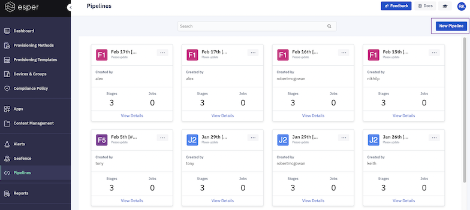
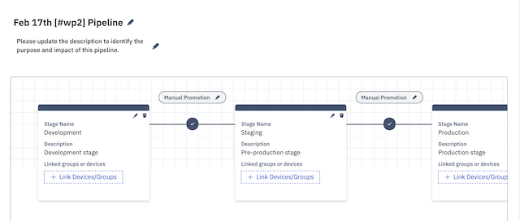
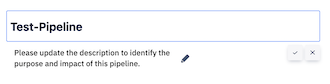
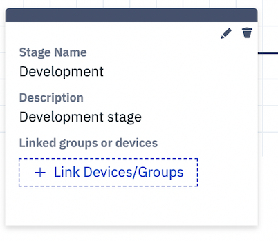
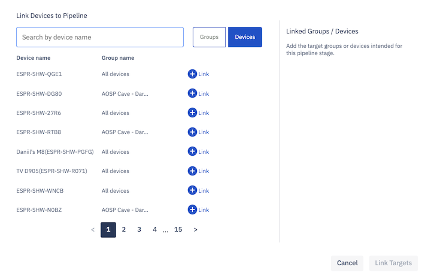

## How to Create a New Pipeline?

  

Step 1: To create a new pipeline, click **New Pipeline**.

  
  

Step 2: You will see a default pipeline created with three stages. You are allowed to remove any stage but a maximum of 3 stages can be created.

  

  

Step 3: You can choose to add a name and a description for the newly created pipeline.

  
  

Step 4: You can then start linking devices or groups to each stage by clicking on Link Device/Groups and repeat for each stage.

  

  

Step 5: Add devices by clicking on the ‘Link’ next to the target. Once you have all the devices needed, click on the Link Targets button, and your pipeline will be ready.

  

