## How to Create a New Pipeline?

Step 1: To create a new pipeline, click **New Pipeline**.

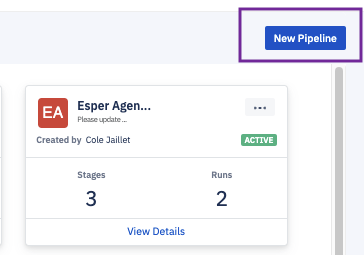

Step 2 The Console will create a pipeline with 1 stage. Here you can edit the pipeline details. 

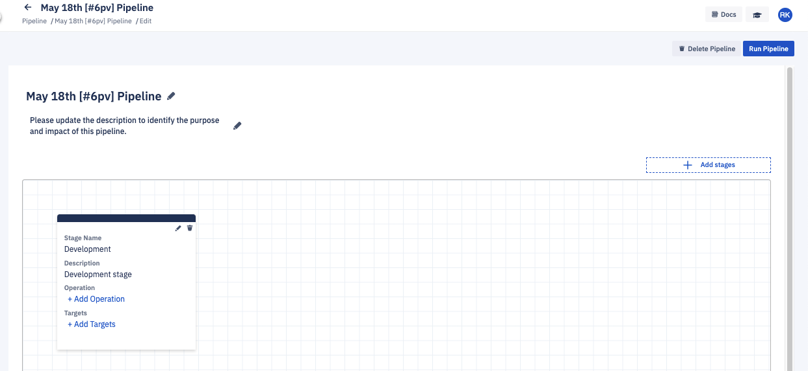

Step 3: You can edit a name and a description for the newly created pipeline.

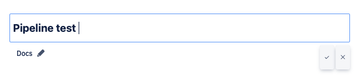

Step 4: To add an operation, click the “Add Operation” link.

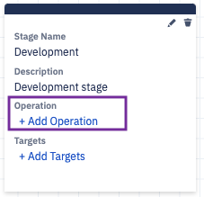

Step 5: On the pop-up, select the ‘App.’

If you select the ‘App’ tab, select the application and the version, and click the **Add Application** button.

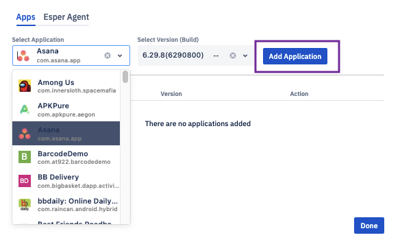

The added application will be displayed.

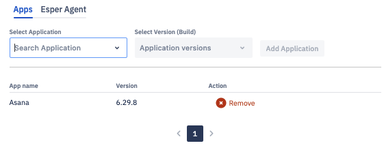

You can add more applications. Once done, click the **Done** button.

Step 6: On the created pipeline, you can see the operations you added.

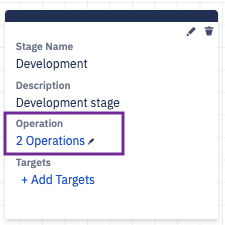

Step 7: Click the” Add Target” link to select the devices or groups.

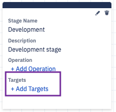

Step 8: On the pop-up, select the devices or groups. Click **Add** to select the device. Click **Remove** to remove the selected device.

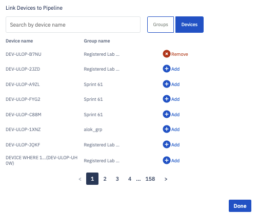

Use the switch to move between groups and devices. Click **Done** when you have chosen the required devices or groups.

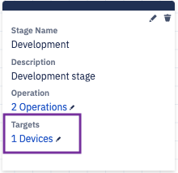

:::tips
You can add a list of devices or groups in one stage but not both.
:::

Step 9: The created pipeline is displayed on the ‘Pipeline’ landing page.

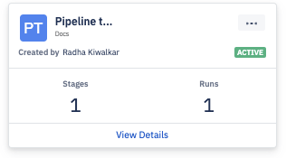