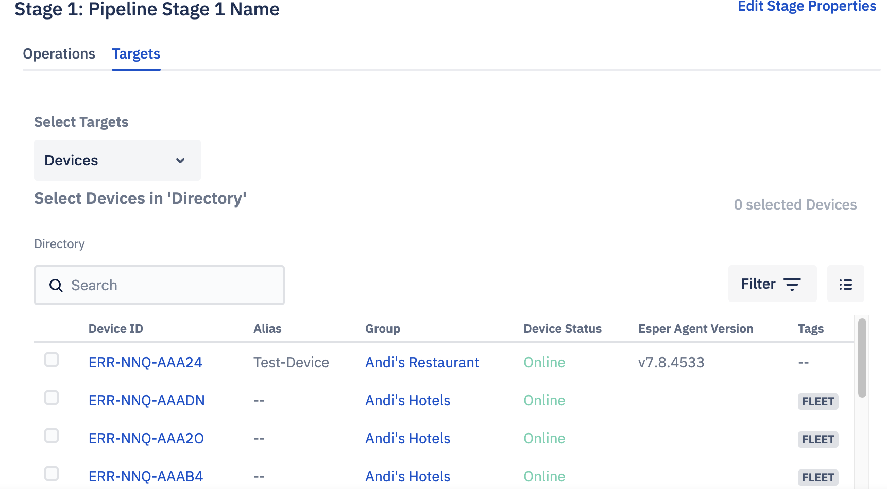

## How to Create a New Pipeline?

Step 1: Log in to the Console and navigate to the Pipeline menu from the left pane. To create a new pipeline, click Create Pipeline on the landing page.

Step 2: The Console will create a pipeline with 1 stage. The pipeline will adopt its name from the creation date and time by default. Here you can edit the pipeline details.

Step 3: Click Edit Properties. 

Enter a different name and a description for the newly created pipeline on the modal. Click Update.

Step 4: To add an operation, click the “Operation” link.

Choose the operations and the version from the menu list and click Add. The added application will be displayed to the right.

Step 5: Click Target to add devices.

Select the device you wish to push the update to.

Your pipeline is now created and ready to run.

