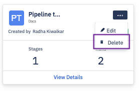
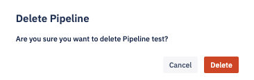
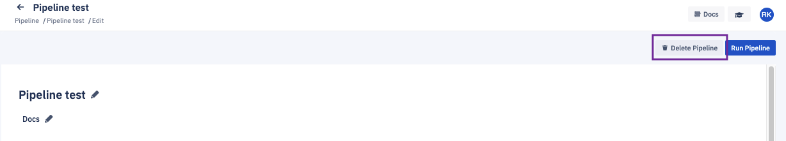

## How to Delete a Pipeline?

To delete a pipeline, click the ellipsis (...) on its tile and select 'Delete' from the drop-down.

Once you confirm the delete option on the popup, a success/failure toast message will be displayed. Clicking  **Cancel** will take you back to the pipeline.

Alternatively, you can delete the pipeline from the create pipeline or edit pipeline screens. Once you confirm your choice on the pop-up, the pipeline is deleted.

