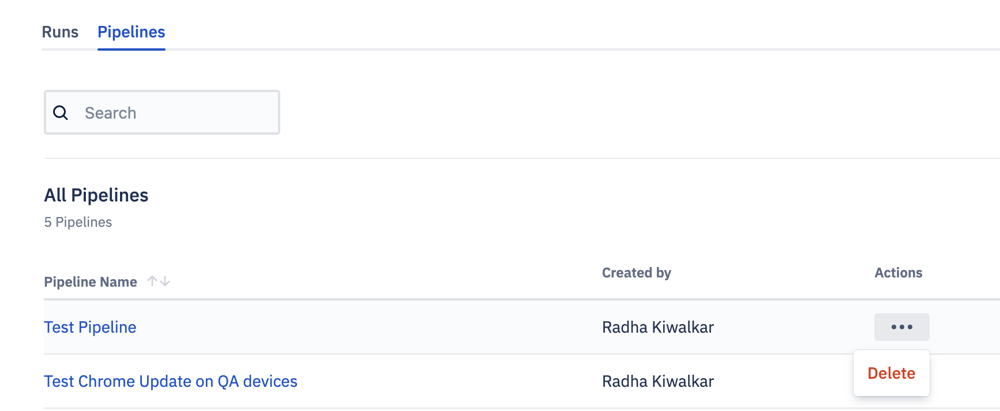

## How to Delete a Pipeline?

To delete a pipeline, navigate to the Pipeline tab on the landing page. Click the ellipsis (...) for the pipeline you wish to delete.

Once you confirm the delete option on the popup, a success/failure toast message will be displayed. Clicking  **Cancel**  will take you back to the pipeline landing page.
