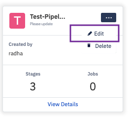

## How to Edit a Pipeline?

  

To edit an existing pipeline, click the ellipsis (...) on its tile and select ‘Edit’ from the options. This will allow the user to edit name or description, change the number of stages (between 1-3) and update the target groups or devices.

  

