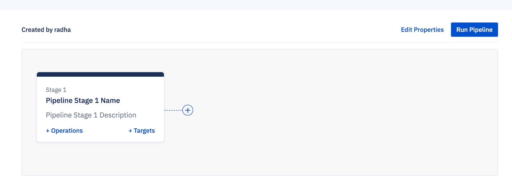
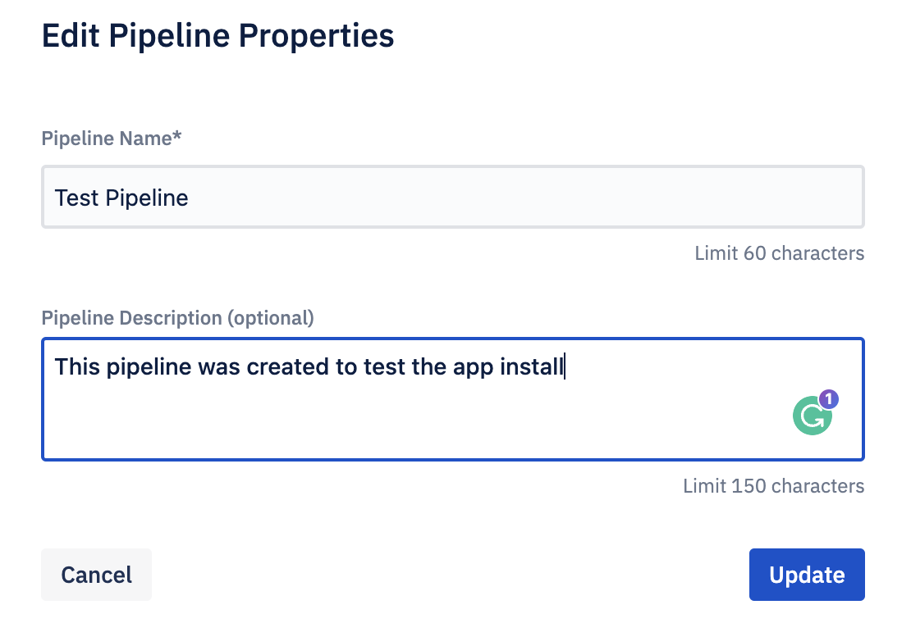
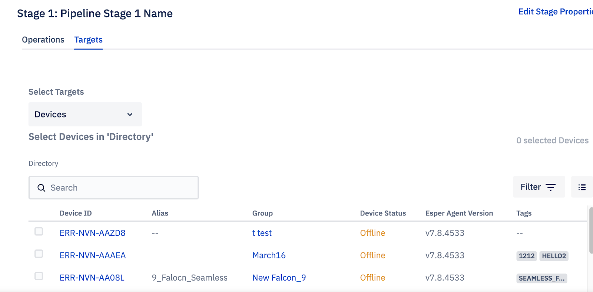
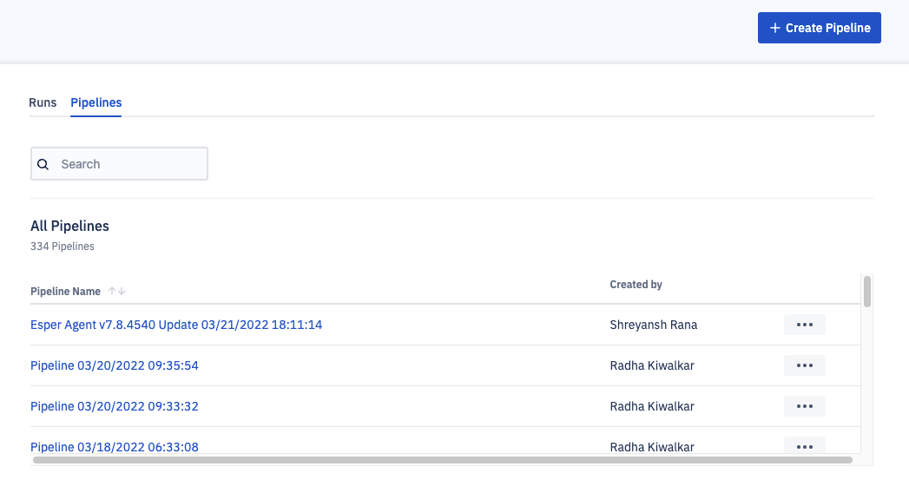
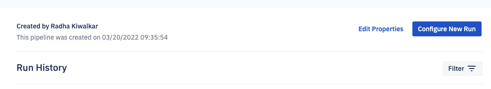
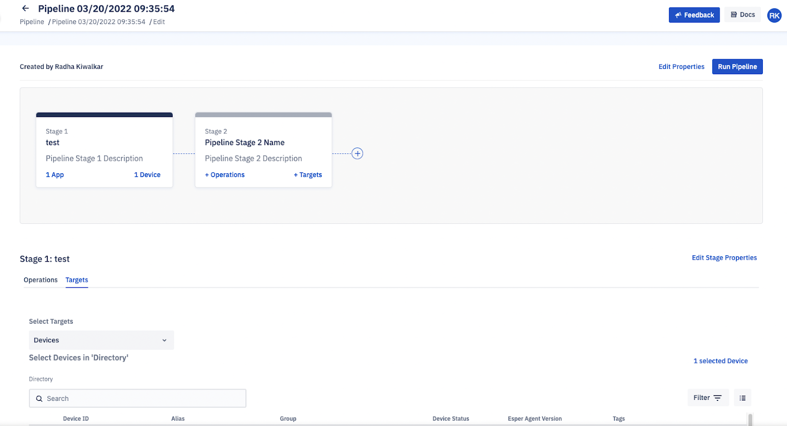

## How to Edit a Pipeline?

Click Edit Properties.

Enter a different name and a description for the newly created pipeline on the modal. Click **Update**.

You can edit the properties of the stage— name, and description. Click Edit Stage Properties.

Navigate to the Pipelines tab on the landing page to edit the targets and operations. Click the name of the pipeline.

Click  **Configure New Run**.

You will be on the pipeline details page, where you can edit the operations and targets of each stage. Once done, click  **Run Pipeline**  to configure a new run.

