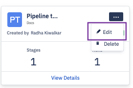
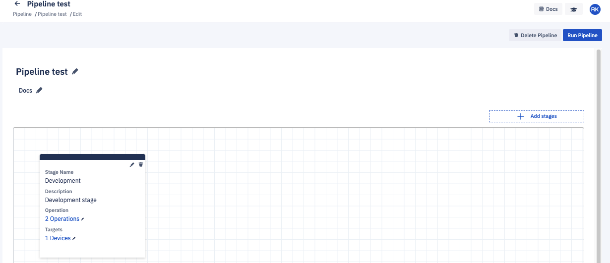

## How to Edit a Pipeline?

To edit an existing pipeline, click the ellipsis (...) on its tile and select ‘Edit’ from the options.

This will allow you to edit the name or description for the pipeline and the stage. You can add more stages as well as edit the operations and the targets.

