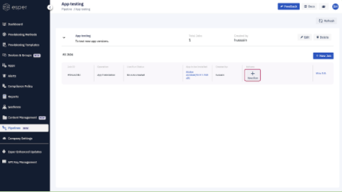
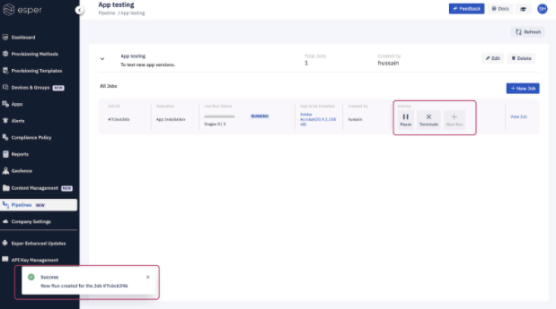
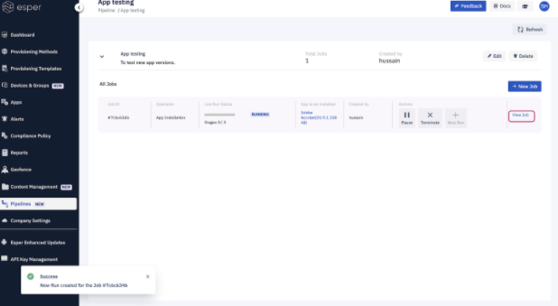
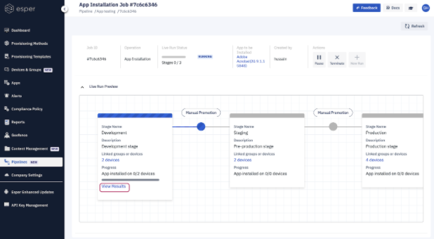
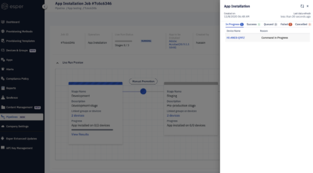

## How to Run a Job in Pipeline?

  

Step 1: To run a job click on a **New Run** on the job title.

  

  

Step 2: Run will start and you get a success message. More actions will appear where you could pause or terminate the run.

  

Step 3: Click on **view job** to see running pipeline status.

  

  
  

Step 4: You can check the stage status by clicking on view results.
ß
  

  

Step 5: A slider-out will pop-up where you could see the status of stage tasks.

  

