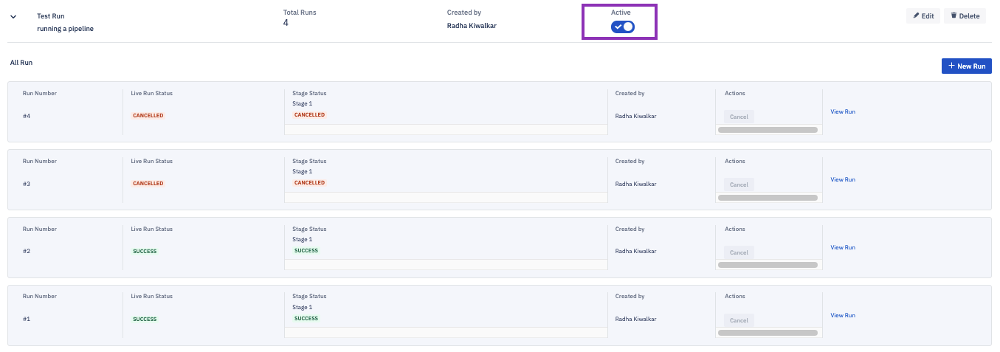

## How to Run a Pipeline?

  

Step 1: Once you have created the pipeline and added the operations and the targets, click the **Run Pipeline** button.

  

  

Step 2: The status of the run is displayed. Here, you can use the ‘Active’ toggle button to set the pipeline ON/OFF.

  
:::tips
You cannot run an inactive pipeline.
:::

  

:::tips
Only one instance of a pipeline can be run at a time.
:::
  

The **New Run** button is disabled when a pipeline is running.