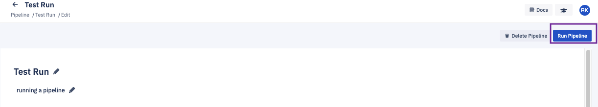

## How to Run a Pipeline?

 Step 1: Once you have created the pipeline and added the operations and the targets, click the  **Run Pipeline**  button.

  

::: tip
Only one instance of a pipeline can be run at a time.

The **Configure New Run** button is disabled when a pipeline is running.
