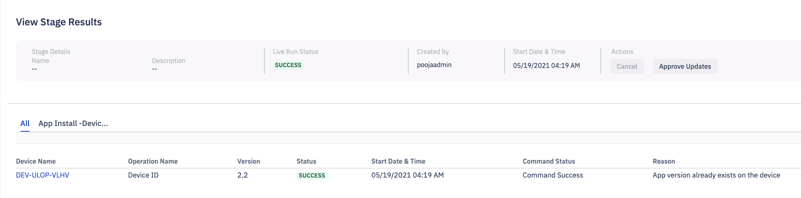

## How to View Pipeline Details?

  

Step 1: On the Pipeline landing page, click the ‘View Details’ link for the selected pipeline.

  

Step 2: Click the ‘View Run’ link to view the live run preview for the pipeline. You can use the ‘Active’ pipeline toggle switch to turn the pipeline ON/OFF on the pipeline details.

  
::: tip
You cannot run an inactive pipeline.
:::
  

  

You will be able to view the line run preview for the pipeline. Here, you will be able to see the progress of each stage. Click **Cancel** to stop the pipeline in the process.

When you click the “View Results” link, you will see details of the pipeline. Here you can find the list of targets, the operation performed, the start date and time, and the status of the pipeline. You also have the ability to cancel the running of the pipeline.

  

  

::: tip
The Cancel button will be disabled once the pipeline is successfully completed.
:::