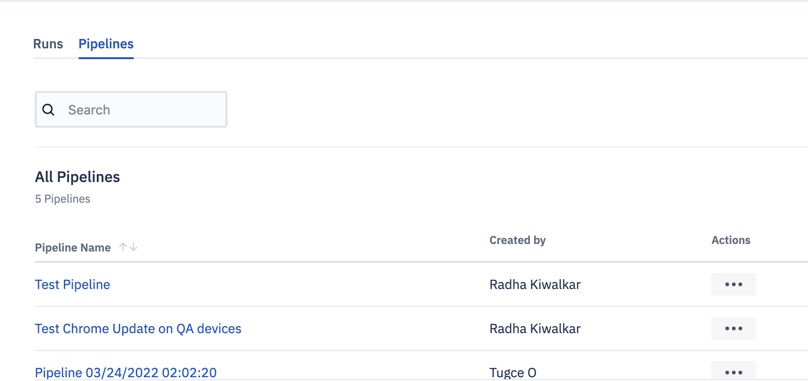
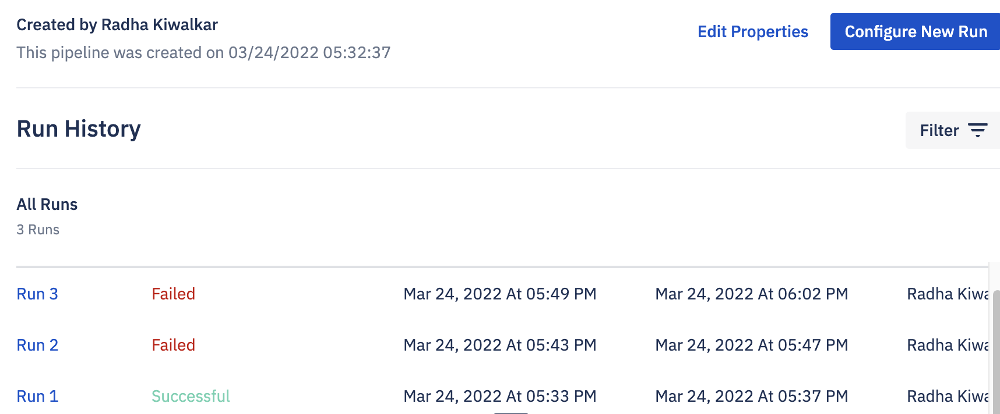

## How to View Pipeline Details?

  

Step 1: On the Pipeline landing page, navigate to the Pipelines tab. Click the name of the Pipeline.

  

Step 2: Here you can see various Runs for this pipeline.
  

Further, click on the run to view its details. You can also configure a new run.