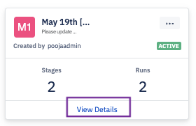
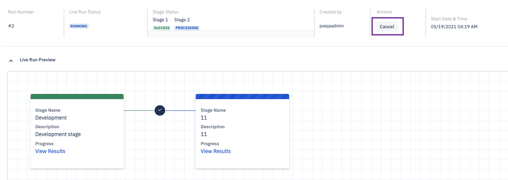

## How to View Pipeline Details?

  

Step 1: On the Pipeline landing page, click the Pipeline name in the run tab to view the details of the run. Alternatively, you can navigate to the Pipeline tab and click the pipeline name to view details of the Pipeline. 

  

On the Run tab, click the name of the pipeline to enter the details page. Here, you cancel the run of the pipeline or cancel the run for a stage of the pipeline. 

  

You will be able to view the details of the entire pipeline from the pipeline tab on the landing page. (Pipelines tab> click the name). Click **Cancel Run** to stop the pipeline in the process.

::: tip
The Cancel button will be disabled once the pipeline is successfully completed.
:::