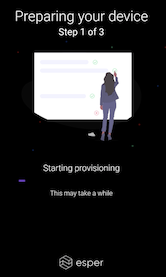
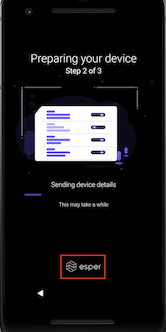

## How to use the Six-Tap Provisioning Method?

Android devices with Google Mobile Services (GMS) support and a camera can be enrolled and provisioned onto Esper using the Android for Work (AFW) provisioning method. The particular provisioning screens and device provisioning flow vary across Android versions.

**Note**: 6 Tap QR Code support was first delivered in Android 7. On some Android versions, primarily Android 9 and above, some of these screens may not appear at all. If you have any questions or issues with 6 Tap QR Code-based provisioning, please email us.

Device makers and carriers customize the setup process. Thus it is likely you’ll encounter unique setup screens specific to your device. Generally, you can either skip or decline most of the options.

**Note**: There is a handful of system-specific notifications called out in the instructions for which you’ll need to make the proper selections.

From the Provisioning Methods screen, if you select 6 Tap QR Code, you will be taken step by step through instructions using the 6 Tap QR Code provisioning process. You can progress through these steps by clicking **Next**.

The steps outlined below are a more detailed version of the same steps provided in the Console. Be sure to have your Provisioning Template created to access the QR code you will use to provision your device.

Step 1: Begin by factory resetting  your device.

Step 2: Once the factory reset is completed, on the first setup screen, tap anywhere on the screen six times.

Step 3: If your device first needs to download the QR code reader, you’ll see the QR code setup screen. Suppose you see this screen go to the QR Code Reader Setup  section.

Step 4: If your device has the QR code reader in ROM, after tapping six times in the open space of the first set up screen, the QR code reader screen will be opened.

Step 5: Go to the Esper Console and select 'Provisioning Templates' in the left menu bar. Find the template you want to use, and then select '**View QR code**.'

Step 6: The QR code for the template will now appear on your screen.

Step 7: If you are using the instructions provided in 'Provisioning Methods,' you can also display the QR code by selecting the Provisioning Template from the Select Template drop-down menu and then clicking **View QR Code.**

Step 8: Hold up the device’s camera to your computer screen, centering it on the QR code.

The QR code is densely populated. If your device’s camera has trouble scanning it, follow these tips:

-   Increasing brightness of your PC’s screen
    
-   Changing the distance between the camera and the screen - move your device closer or further from the QR code
    
-   Hold the device still for a few seconds once you have adjusted the distance.
    

Step 9: If your device does not have an active cellular data network connection or isn’t set up to connect to a Wi-Fi access point specified in the QR code to use for provisioning, you will need to connect the device to the internet either using the cellular data or via Wi-Fi. To do so, you will need to either enable your SIM or enter your Wi-Fi access point credentials.

Step 10: You may then see a screen to accept specific terms from Google regarding Esper managing your device. Click **ACCEPT & CONTINUE**.

Step 11: Once the Esper agent has successfully downloaded, provisioning will start.

If you wish to exit the provisioning process for any reason, click on the **Esper** logo six times to bring up the option to factory reset the device.

Step 12: If your Provisioning Template enables Google Play, Google Play Services will not be updated. Be patient during this process, as it is conducted by Google and depends on their current service quality.

Often, the device will complete provisioning without any permissions needing to be granted on the device. Occasionally, you will need to resolve permissions for Esper to modify System settings and/or Esper to draw over other apps. Please grant these permissions if prompted.

Step 13: You will now return to the Esper agent to install any Esper Enterprise apps and complete the provisioning process.

Provisioning will complete, and you’ll see your device set up according to your provisioning template. In this example, we’ve provisioned in multi-application mode with three Enterprise apps installed from the Esper Cloud and managed Google Play enabled.

