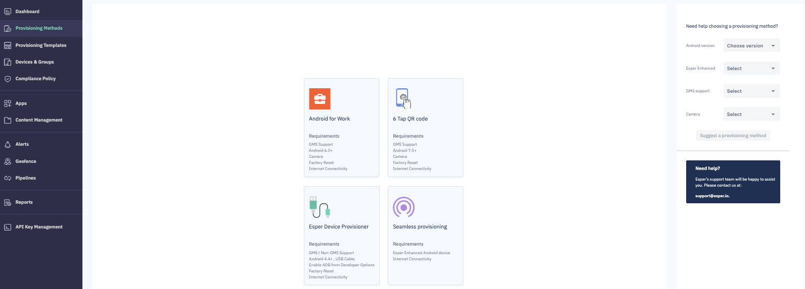

## What is a Onboarding Method?

Provisioning is the initial step of enrolling, configuring, and managing an Android device using the Esper platform and associated developer tools. Esper provides several different methods for provisioning Android devices, depending on the capabilities of the device being configured:

-   Android for Work, part of Android for Enterprise
-   6 Tap QR Code, part of Android for Enterprise
-   The Provisioner Tool
-   Seamless Provisioning
    

Additional provisioning methods may be available, including Google Zero-Touch Enrollment, Samsung Knox Mobile Enrollment, IMEI/Serial Number-based, NFC-based, and in some specific cases using a downloaded APK. Please contact [Esper team](mailto:support@esper.io) to find out if your account qualifies and your device is supported.

If you meet the prerequisites, you may provision your device using any of the above methods. To select one of the provisioning methods, or to view detailed steps for that method, hold your mouse over the method, and the **Provision** button will appear. Click on the **Provision** button, and detailed steps for the selected method will be displayed.

