## How to Provision using Android-for-Work (AFW) Method?

Android devices that have Google Mobile Services (GMS) support and a camera can be enrolled and provisioned onto Esper using the AFW provisioning method. The particular screens and flow vary across Android versions.

**Notes**:

1.  AFW support was first delivered in Android 6.0. On some Android versions, primarily Android 9 and above, some of these screens may not appear at all. If you have any questions or issues with AFW-based provisioning, please email us at (support@esper.io).
    
2.  Device makers and carriers customize the setup process. You’ll likely encounter unique setup screens specific to your device. Generally, you can either skip or decline most of the options. There are a handful of system-specific notifications listed in the steps below, for which you’ll need to make the proper selections.
    

On the Provisioning Methods screen, if you select Android for Work, you will be taken step-by-step through instructions using the AFW provisioning process. You may follow through with these steps by clicking **Next**.

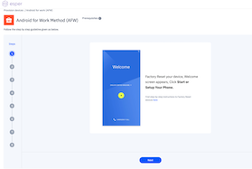

Please have your Provisioning Template created so you can access the QR code to provision your device.

Step 1: Begin by [factory resetting](https://docs.esper.io/home/console.html#how-to-factory-reset-your-device) your device.

Step 2: Once the factory reset is completed, on the first screen, click on the **START** button.

**Note**: The button title may be a variation of getting started, setting up your device, or let’s go.

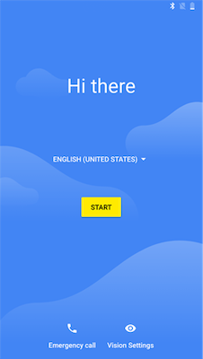

Step 3: If your device does not have an active cellular data network connection, you will need to connect the device to the internet using cellular or Wi-Fi.

If you have a cellular device without a SIM, you may encounter the below screen first. Select **SKIP** if you plan to use Wi-Fi. Otherwise, proceed to insert your SIM with cellular data support.

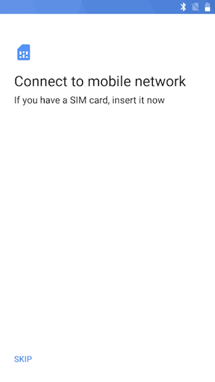

Step 4: When presented with the ‘Copy apps & data’ screen, select ‘Set up as new’. This text may be ‘Don’t Copy’ or another variant.

**Note**: On some devices, this may appear after establishing a Wi-Fi connection.

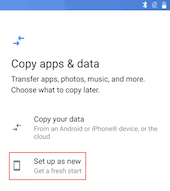

Step 5: If you are using Wi-Fi, then complete the steps to connect to your desired access point.

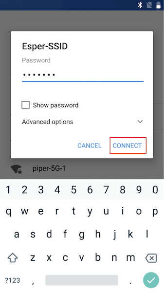

Step 6: You will see a ‘Checking for updates’… screen that may change to ‘Just a sec… ‘and/or ‘Checking info….’. Please be patient as the device is preparing for enrollment.

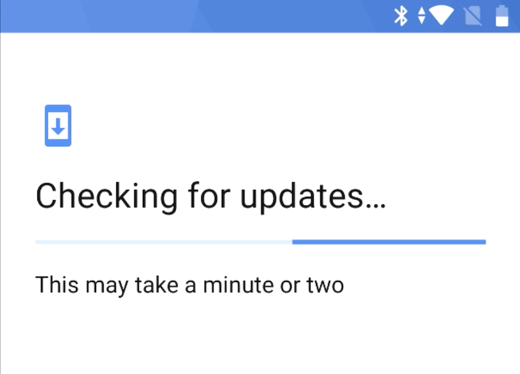

Note: It will take a few moments for the Google ‘Sign-in’ screen to appear.

Step 7: In the Email or phone field, enter **afw#esper** and then select **Next**. As a certified Google EMM partner, this is a particular keyword used by the AFW provisioning process that will then start the process to enroll your device into Esper.

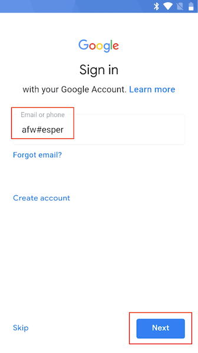

Step 8: You will need to give permission to install the Esper agent on your device to begin the enrollment process. Select **INSTALL**.

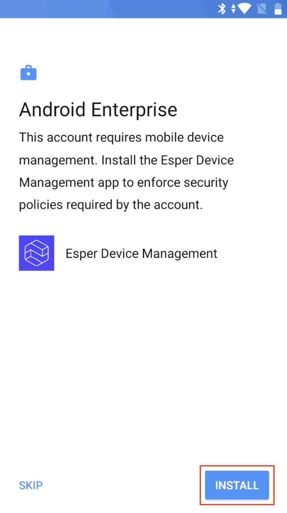

Step 9: The Esper agent will be downloaded to your device. Please be patient.

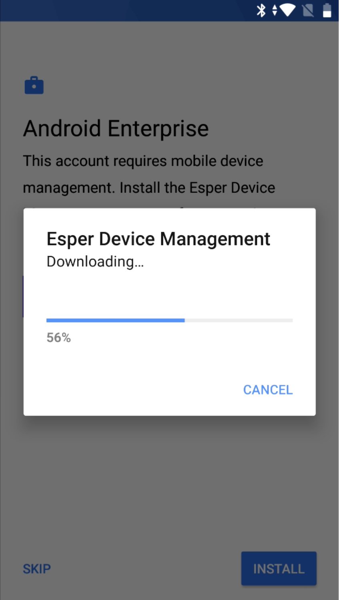

**Note**: On some devices, you will need to click **INSTALL** again after the agent downloads.

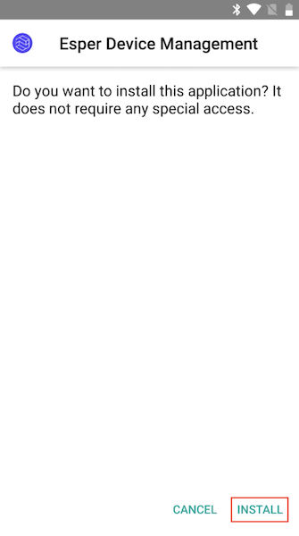

Step 10: A screen may display asking you to accept specific terms from Google regarding Esper managing your device. Click or touch '**ACCEPT & CONTINUE.**'

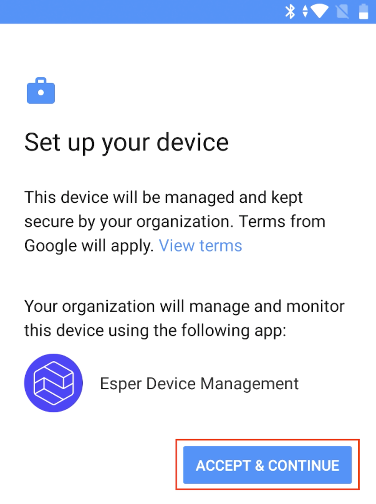

The Esper agent will now start the installation, and a series of screens will display as Esper prepares for the enrollment.

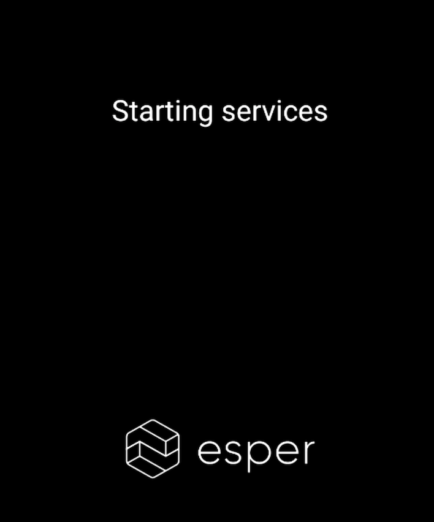

Step 11: Go to the Esper Console and click on **Provisioning Templates** in the left menu bar. Find the template you want to use, and click on the **View QR code**. The QR code for the template will appear on your screen.

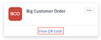

**Note**: If you are using the Provisioning Methods instructions, you can also display the QR code by selecting the Provisioning Template from the Select Template drop-down and then clicking View QR code.

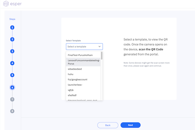

Step 12: The QR code scanner should appear on your device. Hold the device’s camera to your computer screen, centering it on the QR code.

**Note**: The QR code is densely populated. If your device’s camera has trouble scanning it, use the following tips:

-   Increasing brightness of your PC’s screen
    
-   Changing the distance between the camera and the screen - move your device closer or further from the QR code
    
-   Hold the device still for a few seconds once you have adjusted the distance

Step 13: Once Esper has successfully read the QR code, provisioning will start.

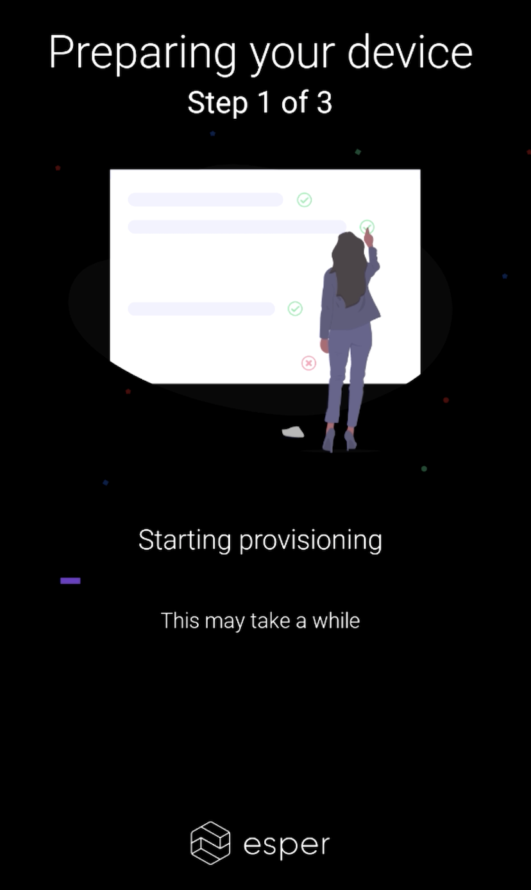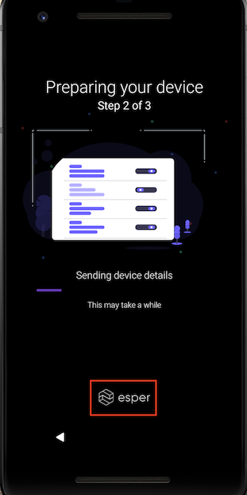

**Notes**:

1.  If you wish to exit the provisioning process for any reason, Click on the **Esper** logo 6 times to bring up the option to factory reset the device.
    
2.  If your Provisioning Template enables Google Play, Google Play Services will not be updated. Be aware that this is done by Google and depends on their current quality of service.
    

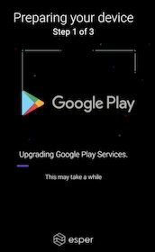

Typically (but not always), you need to resolve the permission and allow Esper to modify System settings. Click on **RESOLVE** to open up the Android System settings application to provide the consent.

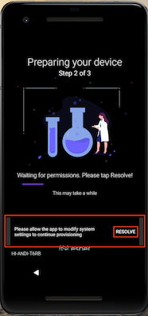

Step 14: On the 'Can modify system settings’ screen and a list of Applications will be displayed.

**Note**: These are Applications that have been granted or are requesting permission to modify system settings. Esper Device Management will be set to 'No,' or 'Not Allowed.' Click on Esper Device Management to change this setting.

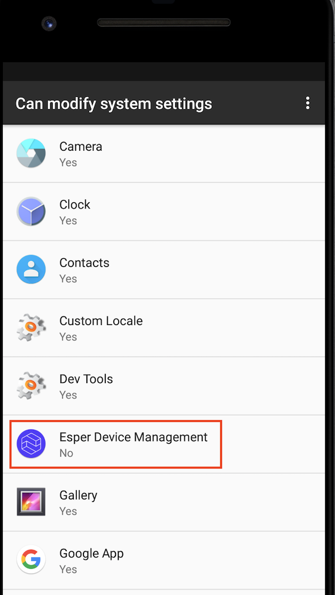

  

You will then be taken to ‘Modify system settings’ for **Esper Device Management**. Turn ON the toggle switch located on the right side of the screen to Allow modify system settings.

  

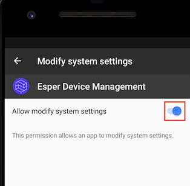

Step 15: Next, click the **Back** button in the upper left-hand corner of the screen.

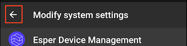

Step 16: You will now be taken back to the 'Can modify system settings' screen. You can verify that Esper Device Management is now set to 'Yes' or 'Allowed' for modifying system settings. Now click the **back** button in the Navigation bar.

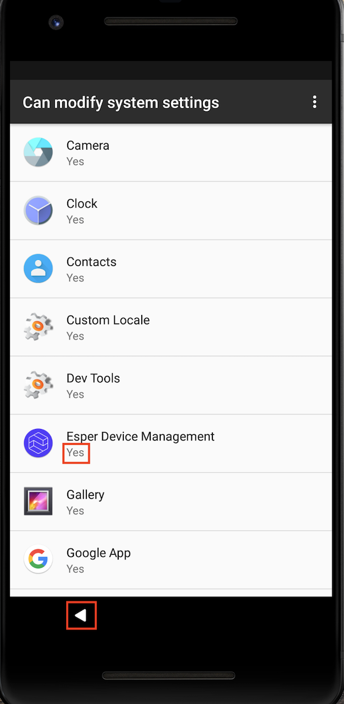

Step 17: You will now return to the Esper agent. You will typically need to grant another permission to allow Esper to draw over other applications. This is done to ensure a smooth experience for Kiosk mode applications. Click on **RESOLVE** to open up the Android system settings application to provide the permission.

Step 18: On the 'Display Over Other Apps' or 'Draw Over Other Apps' screen, you will see a list of apps that have been granted or are requesting permission to display over other applications.

Note: Esper Device Management will currently be set to 'No,' or 'Not Allowed.'

Click on **Esper Device Management**.

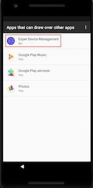

Step 19: You will then be taken to ‘Display Over Other Apps’ or ‘Draw Over Other Apps’ for Esper Device Management. Click on the toggle switch located on the right side of the screen to ‘Allow display over other apps’ or ‘Permit Drawing Over Other Apps’.

Step 20: Next, click on the **back** button in the upper left-hand corner of the screen.

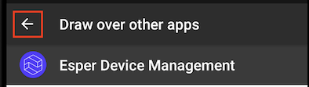

Step 21: You will now be taken back to the 'Display Over Other Apps' screen. Esper Device Management is now set to 'Yes' or 'Allowed' for drawing over other apps. Next, click on the **back** button in the Navigation bar.

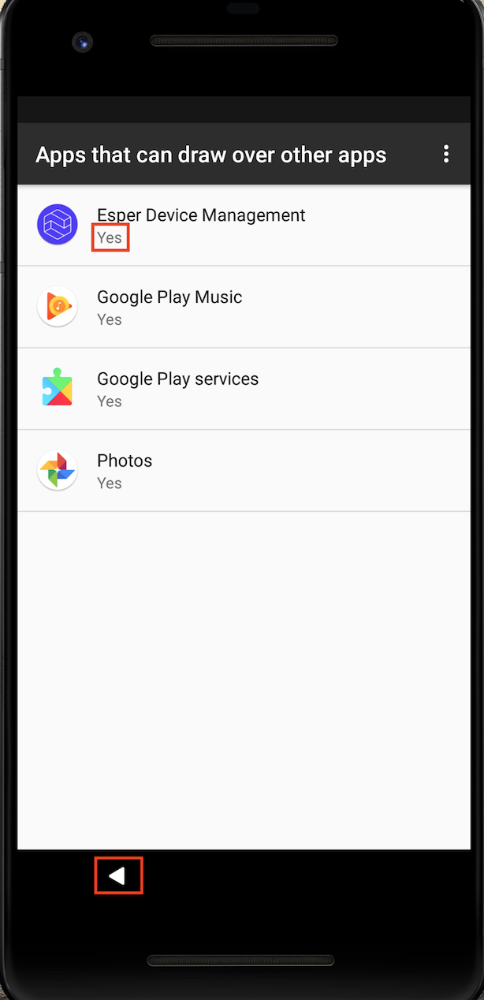

Step 22: You will now return to the Esper agent to install any Esper Enterprise applications.

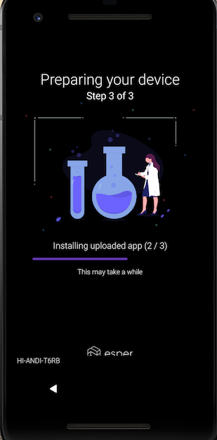

Now the provisioning is complete, and your device is set up according to your provisioning template. In this example, we’ve provisioned in multi-application mode with three Enterprise applications installed from the Esper Cloud and managed Google Play enabled.

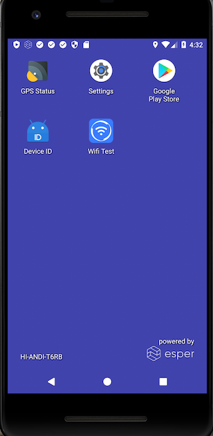