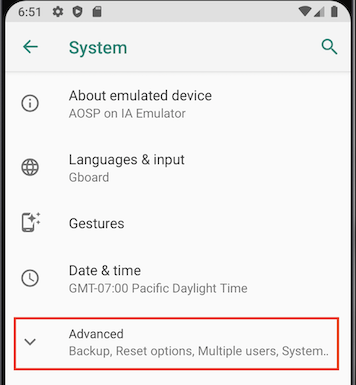
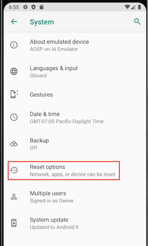
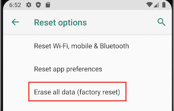
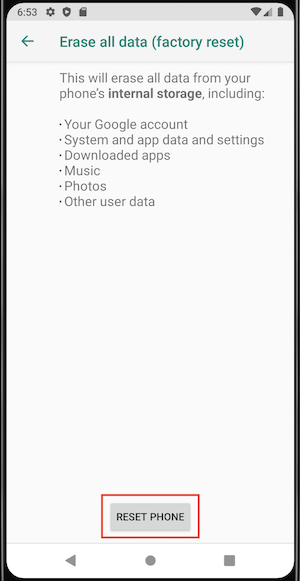
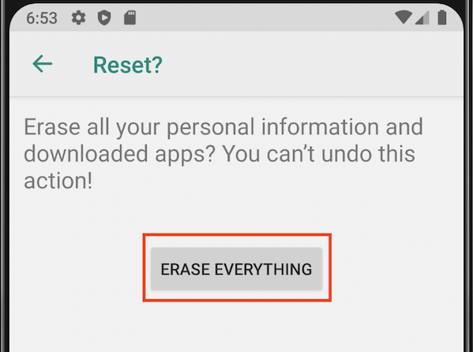

## How to Factory Reset a Device?

It is required to factory reset the device before onboarding. Here are the instructions for how to factory reset a device. These steps use a typical Android device using a Pixel 3 running Android 9 as an example.

Step 1: Open up the Settings application, and select ‘System.’

  

Step 2: Select ‘Advanced’.

Step 3: Select ‘Reset’ options.

Step 4: Click on Erase all data (factory reset) option.

  

Step 5: Confirm your choice on the screen or screens that follow.

 

  

:::tip
It can take several minutes to complete a factory reset.
:::

Once the 'Welcome' screen is displayed, you are ready to provision your device.