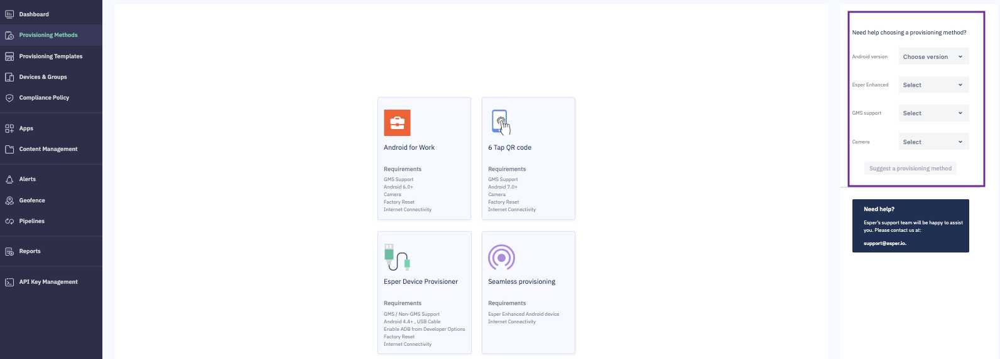

## Need Help Choosing?

If you find choosing between these methods confusing, we have provided an easy way to find the best provisioning method: Fill the form on the right side.

You’ll need to provide the following information:

-   Android version — Check the Android version on your device by navigating to **Settings** > **About** > **Android Version**. Choose the correct version of Android for your device from the dropdown menu.
    
-   Esper Enhanced — Esper Enhanced Android is a purpose-built Android OS optimized for deployment under the Esper system. Esper provides Esper Enhanced devices on request. Click **YES**, if your devices are Esper Enhanced.
    
-   GMS support — Click **YES** if your Android device supports Google Mobile Services.
    

**Note**: If the Play Store application is included on your device, your device will likely support GMS.

-   Camera — Choose **YES**, if your device has a working camera.
    

Then click **Suggest Provisioning Method**.

Based on your selections, the tool will suggest one of the four provisioning methods by highlighting it. Click on it to see the steps to provision your device. If you still have trouble figuring the provisioning process, Esper’s support will be happy to assist you. Send an email to support@esper.io.

**Note**: If a device stalls during provisioning, there’s a way to exit out and factory reset it. On any provisioning screen showing the Esper logo, tap the logo seven times. This will bring up the Factory Reset button. Simply click the button to start the reset process.