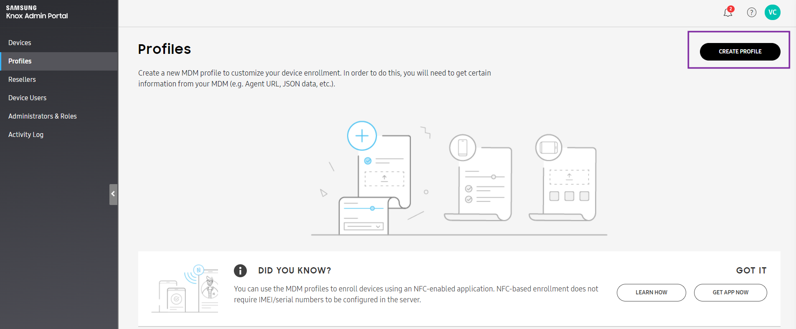
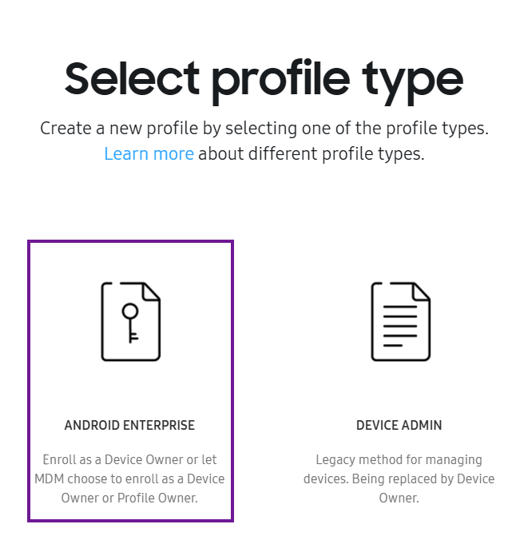

# How to Onboard a Device Using KME?

Samsung Knox Mobile Enrollment (KME) is an onboarding method offered by Samsung for its devices. Upon first boot or factory reset, KME forces Samsung devices to enroll into Esper. Follow the steps below to onboard a device using KME.

Step 1: Navigate and log in to the [Knox Mobile Enrollment (KME)](https://central.samsungknox.com/login-navigator) portal.

Step 2: Select the Knox Mobile Enrollment Portal to launch the Console.

You will be taken to the device page, where you can see all the devices added to your KME portal by the reseller.

Note: If you don’t see a device here, please contact your reseller and get the devices added to the KME portal.

Step 3: Select Profile from the left menu. Click Create Profile.

Step 4: Select Android Enterprise.

Step 5: Fill in the Profile details. Enter the Profile name and optional description.

Under the MDM Information, select ‘Force Device Owner enrollment.’ In the Pick our MDM drop-down, select the 'Other' option. To enter the MDM Agent APK link, you can enter the default Esper Agent link ([https://play.google.com/managed/downloadManagingApp?identifier=esper](https://play.google.com/managed/downloadManagingApp?identifier=esper)) from Google Play. If you are using a custom Esper Agent, please contact [Esper](https://support.esper.io/s/) for the URL for the APK. Click Continue when done.

Step 6: You will be taken to the Android enterprise profile settings screen.

To enter the Custom JSON data, go to the Esper Console and navigate to the template.

Copy the contents of the Admin Extra Bundle from the downloaded Config file and paste it into the Custom JSON data. Under device settings> System applications, select ‘Leave all system app enabled.’ Enter the company name and click Create.

The created profile will be displayed on the profile screen.

If you click the profile name, you will be able to edit and save the created profile.

Step 7: Click on the ellipsis and choose Configure devices from the drop-down.

Step 8: Select the profile you just created from the drop-down and click Save.

The profile will be added to the device and displayed on the device screen.

When you factory reset the device, you will go through the Android standard setup process on the device. If you connect to the internet during this setup process the Knox profile will be found and it will automatically start the provisioning process after a few license/onboarding prompts.

