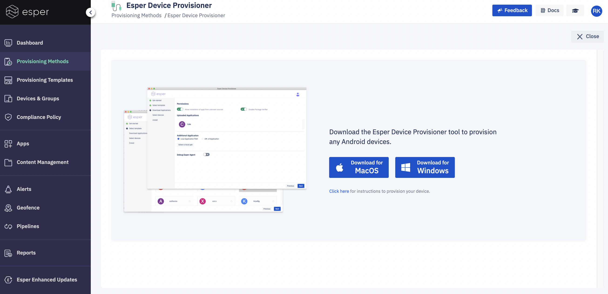

## How to use the Device Provisioner Tool for Provisioning?

For your ease, we have created a tool for Provisioning which internally uses the ADB (Android Debugging Tool).

This method can be used to provision most Android devices regardless of whether they are -

-   GMS or Non-GMS
-   Have a camera or not
-   All Android versions including 4.x and 5.x
    
We have made the Device Provisioner user-friendly, and it takes you through a step-by-step process with minimum logs seen on the screen.

:::tip
User should have access to Esper endpoint, have the provisioning template created, the device physically available and connected to the computer via USB.
:::

Download the compatible version for Windows and Mac system and follow the steps to provision via Provisioner Tool from  [here](https://docs.esper.io/home/provisioner.html).