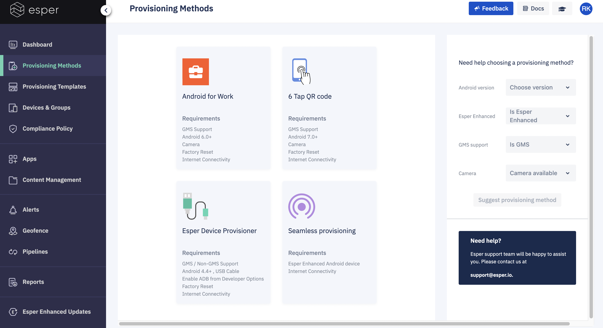

## How to Select a Provisioning Method?

Each of the provisioning methods is best suited for different situations. Click on the name of a method to get specific instructions.

:::tip
Internet connectivity is mandatory to enroll a device using any of the provisioning methods.
:::

### Android for Work (AFW) Provisioning

The AFW method is best used for:

* Devices that have GMS (Google Mobile Services) support enabled

* Devices with a camera for QR code scanning

* Android 6.0 and above

* Factory reset of device required

You can also use IMEI / Serial Numbers with the AFW provisioning method on some devices. This is useful when shipping a device directly to a customer, so they can provision it themselves or for the devices without a camera. Provisioning devices using IMEI/Serial number also prevents users from repurposing the device by exploiting the ability to conduct a factory reset. To learn more about provisioning devices using the IMEI or serial number method, please review [IMEI/Serial Number Based Provisioning](./imei-provisioning.md). Please view the [Upload IMEI CSV](../provisioning-template/upload-imei.md) page for more information on loading IMEIs and Serial Numbers into a Provisioning Template.

### Six Tap QR Code Provisioning

6 Tap QR code provisioning is best used for:

* Devices that have Google Mobile Services (GMS) support enabled

* Devices with a camera for QR code scanning

* Android 7.0 and above

* Factory reset of device required

Beginning with Android 9, you can include credentials for the Wi-Fi network to be used for provisioning in your template. They’ll be included in the QR code, thus eliminating the need to enter them on the device to establish the required Internet connectivity.

:::tip
Xiaomi/Redmi devices do not support a 6-tap provisioning method.
:::

### The Device Provisioner

The Device Provisioner is a user-friendly provisioning tool by Esper that runs on Mac, Linux and Windows. While intended for AOSP devices that don’t have the Android Enterprise enrollment methods available, it can provision GMS devices, useful for specialized GMS devices without a camera, thus unable to read a QR code used with the 6-Tap and AfW provisioning methods. Android Studio AVDs can also be provisioned using this tool.

You’ll need a USB cable to connect the device to the computer you’re using for provisioning. Ethernet-based and Wi-Fi-based methods can be used if the device is on the same subnet as the computer running the Device Provisioner. You are required to turn on the Developer Options and enable USB Debugging on the device.

**Notes**: 
1) The Device Provisioner does not support Google Single Sign-On (SSO).
2) Some additional steps are needed to provision Xiaomi/Redmi devices using the Device Provisioner tool. Please refer to [Device Provisioner](https://docs.esper.io/home/provisioner.html) documentation for more information.

If you set up your Esper Console login using Google SSO, then you need to go to your account on the Esper Console, enter and save your password. You will no longer be using Google SSO and can now sign-in on the Device Provisioner and continue to use the Esper Console login method.

### Seamless Provisioning

Seamless provisioning is only for devices running Esper Enhanced Android or AOSP custom-built devices that directly support Esper.

IMEI/Serial Number method is used for bulk provisioning of devices. It enables true no-touch provisioning using a predetermined Wi-Fi access point.

Contact Esper (mailto: [support@esper.io](mailto:support@esper.io)) to find out more about Esper Enhanced Android and Seamless Provisioning.