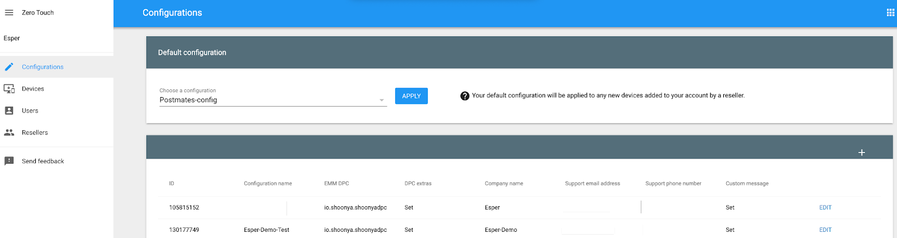
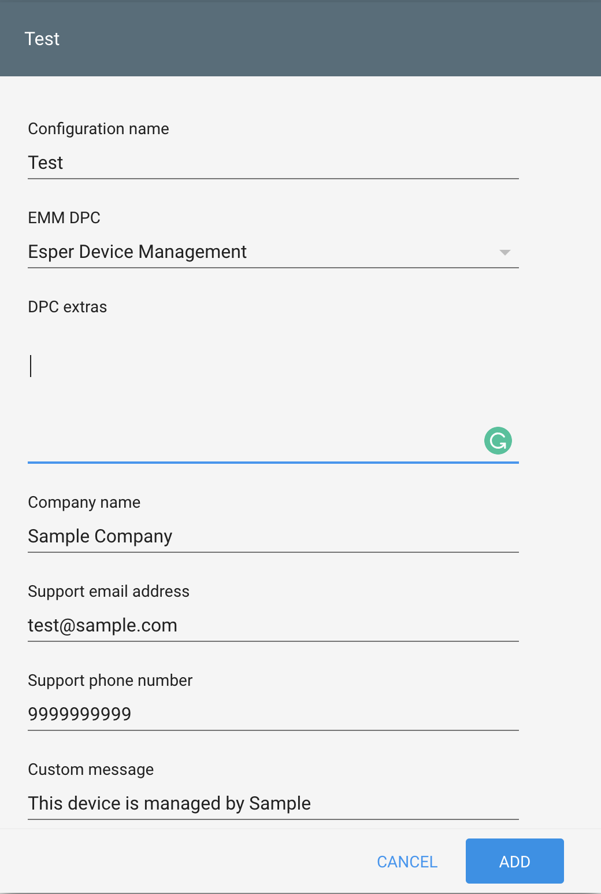
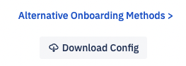
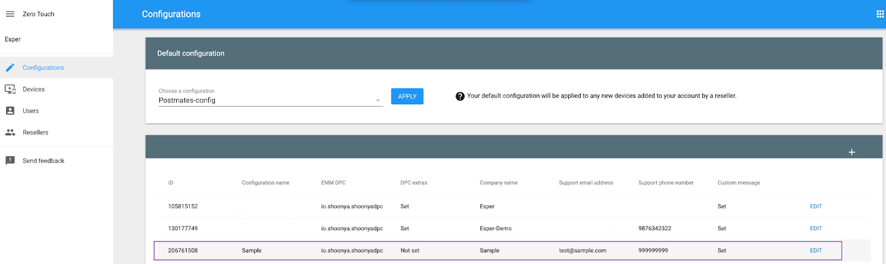
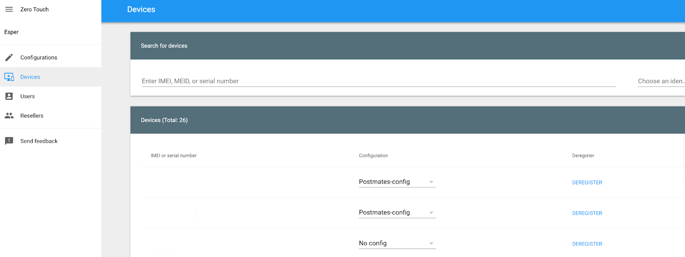
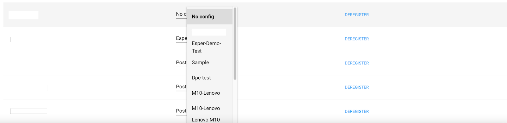
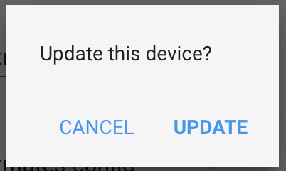
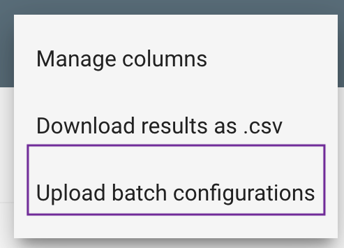
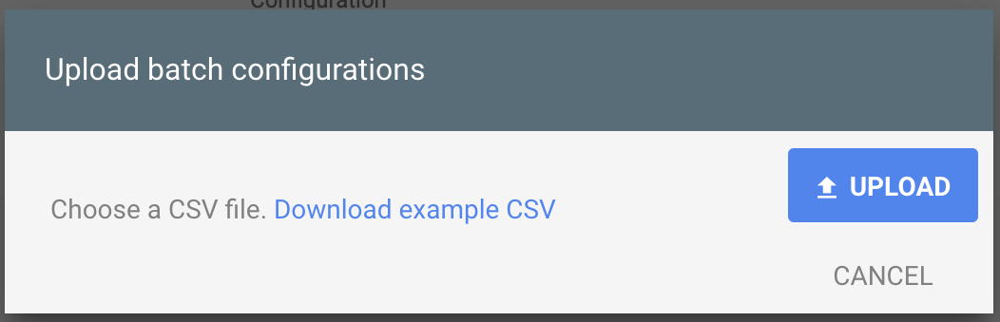

# How to Onboard a Device Using ZTE?

Zero-touch Enrollment (ZTE) is an enrollment method offered by Google for the [selected devices](https://androidenterprisepartners.withgoogle.com/devices). Upon first boot or factory reset, ZTE forces Android devices to enroll into Esper. Follow the steps below to onboard a device using ZTE.

:::tip
This is an alternative method for enrolling devices to the Console.
::: 

Step 1: Navigate and log in to the [Zero-touch Enrollment (ZTE) portal](https://partner.android.com/zerotouch).

Step 2: You will be taken to the Configuration tab.

  



Here you will be able to create a configuration to associate with a device.

Step 3: Click the ‘+’ symbol to add a new configuration.

Step 4: On the pop-up, enter the details — configuration name and EMM DPC (Esper Device Management). Enter your organization’s information for the company name, support email address, support phone number.



To enter the DPC extras, navigate to the Esper Console.



Login to the Esper Console and navigate to the "Device and Group" section. Click the QR code icon associated with the group you want to configure with ZTE and click the “Download Config” button at the bottom of the pop-up window with your QR code. Open the downloaded JSON config file, and copy the following contents:  

:::tip
In the downloaded config file, you will not need a section of the code. Copy only the section below, and use a formatter such as [JSON formatter](https://jsonformatter.curiousconcept.com/) to ensure the code is correctly formatted.
:::

```json
 {
   "android.app.extra.PROVISIONING_LEAVE_ALL_SYSTEM_APPS_ENABLED":true,
   "android.app.extra.PROVISIONING_ADMIN_EXTRAS_BUNDLE":{
      "V":"0",
      "EID":"your-enterprise-id",
      "E":"your-endpoint-name",
      "P":"type-of-provisioning method",
      "OE":true,
      "G":"your-group-code",
      "T":"your-template-code",
      "AT":"your-auth-token"
      }
    }
```
Once pasted into The DPC Extras in Google ZTE, click ADD to finish the process.


Step 5: The added configuration will be displayed on the Configuration tab.



Step 6: Now, you need to add the configuration to the device. Navigate to the device tab. Here all the devices added by the reseller are displayed with no configuration.



Step 7: Select the device you want to associate a configuration. Click on the dropdown and choose the configuration.



Step 8: Confirm your choice, and the device will be associated with the configuration.



You will go through the standard Android setup steps when you factory reset the device. The Zero-touch Portal will find your device and automatically start the onboarding process after a few license/onboarding prompts.

Note: You can assign the same configuration to multiple devices at a time. Navigate to the Device section for bulk upload and choose ‘Upload batch configurations’ from the menu.



Download an example from the pop-up, associate a configuration, and upload a CSV file.



