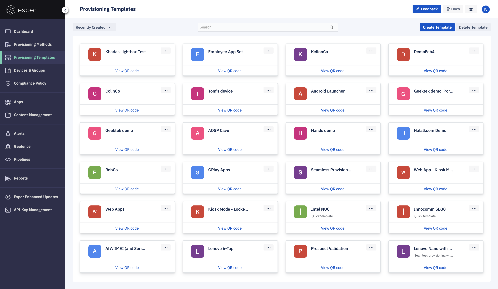
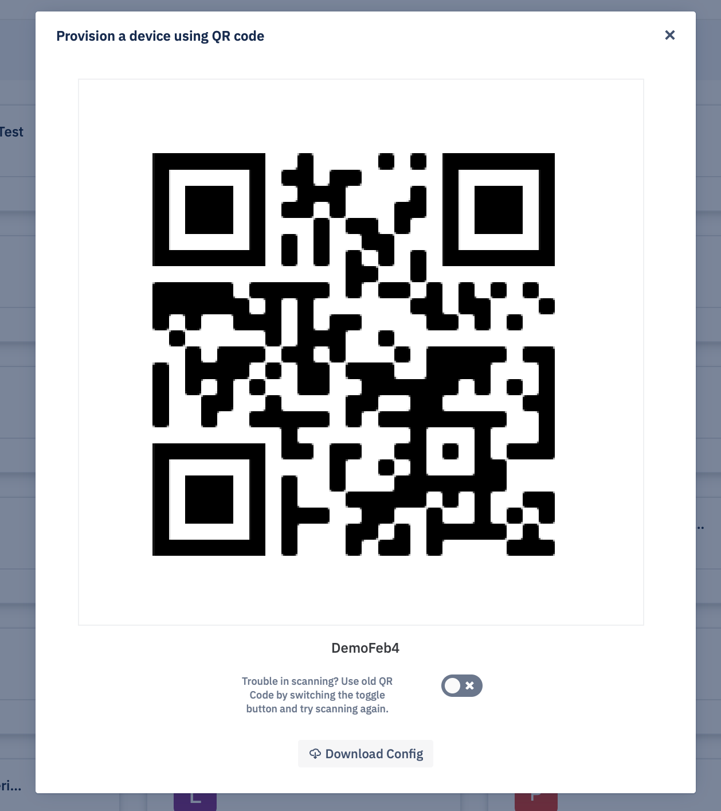

## What is a Provisioning Template?

Provisioning Templates give you a straightforward way to enroll and provision multiple devices. These allow you to create templates for devices in which you specify the compliance policy, applications, device settings, device group, and even the wallpapers you want to be added to your devices.

Provisioning Templates are shown as tiles with the most-recently created at the top. You can find templates by name using the Search Templates feature:

You can access the QR Code for a specific template during Android for Work or 6 Tap QR Code provisioning by clicking on View QR Code.

  

**Note**: Be careful sharing the QR code as in some cases Wi-Fi access point credentials are included, and anyone with it can enroll a supported Android device into your fleet. In cases where distributing a QR code outside of your organization is required, consider using Android for Work IMEI/Serial Number provisioning with a passcode.