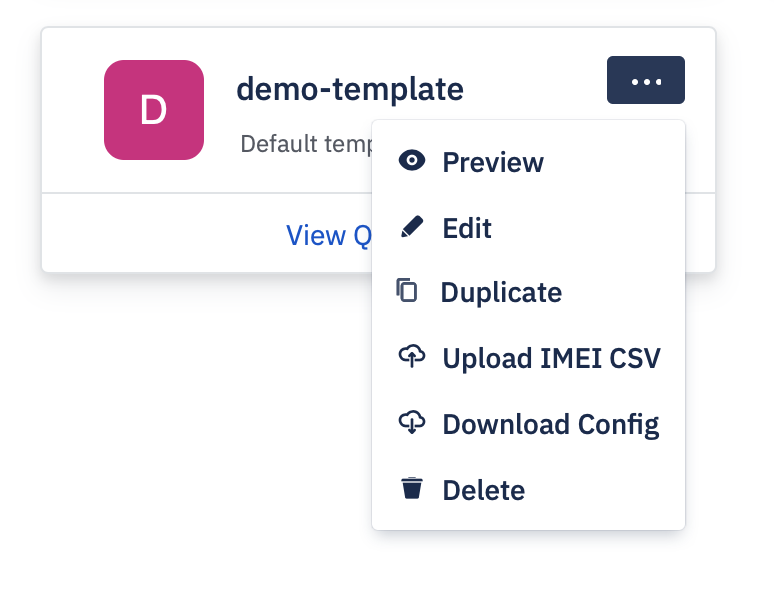
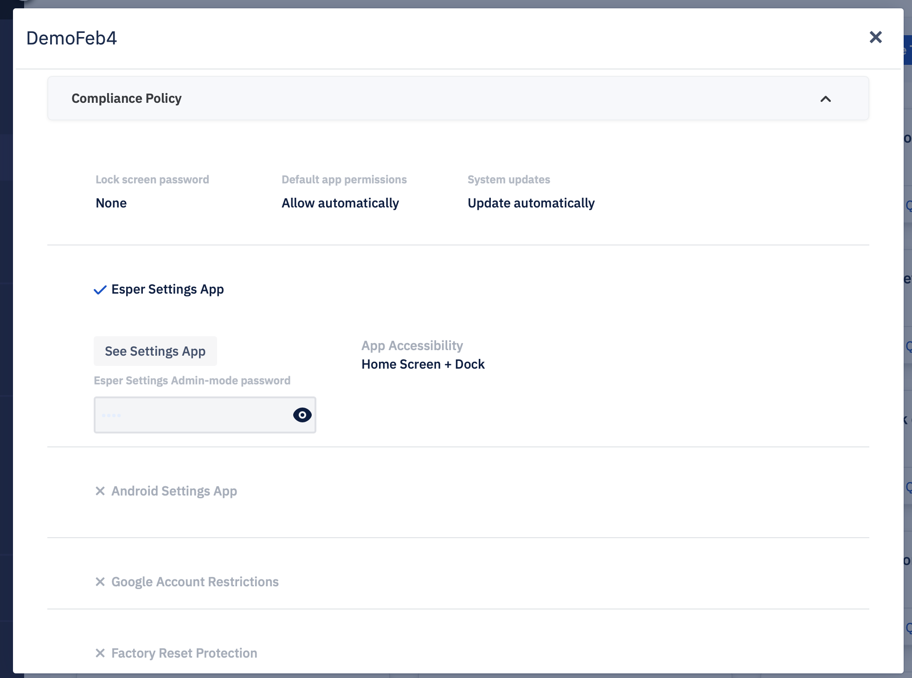
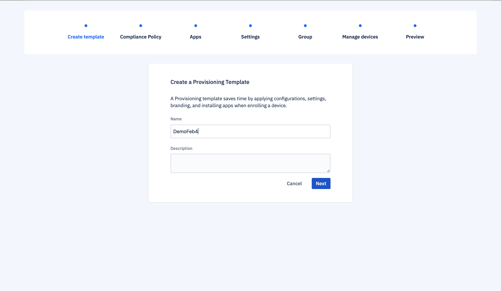
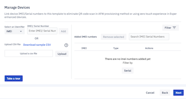
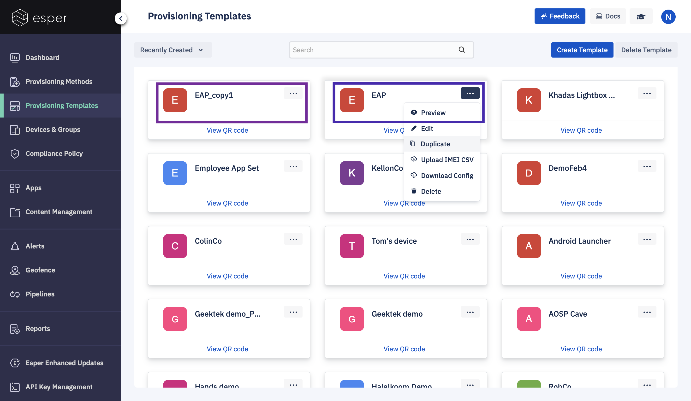
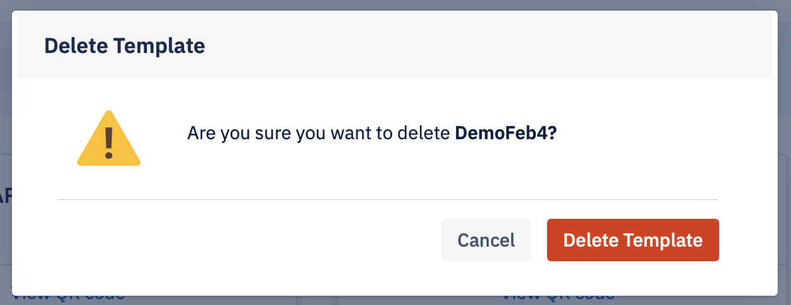

## What are the Available Actions on Template Tiles?

Clicking on the ellipses (...) at the top right of one of the template tiles opens a pop-up menu that enables you to take the following actions on that template:

-   Preview 
-   Edit
-   Duplicate
-   Upload IMEI CSV
-   Download Config
-   Delete
    

### Preview

Click **Preview** to preview the Provisioning Template. Click on the ‘^’ sign to expand each section.

:::tip
You can not edit the template using Preview.
:::

### Edit

To edit a template, click **Edit**. You can update the Policy, Applications, Settings, Group, and Manage Devices options as you wish. The edit screen will take you through steps to make changes. Clicking on the **Next** button, you will be able to access the following setting. To save your changes, click on the **Update** button on the ‘Preview’ page.

  

The **Cancel** button will take you back to the ‘Provisioning Templates’ landing page.

#### Manage Devices

The Manage device section is added only when you are editing a template.

  
:::tip
This section is not available when you create a new template.
:::

You can add, upload or download IMEI or serial number through a CSV file using the Manage Devices section. You can now upload CSV files with up to 3000 IMEI/ Serial numbers to the template. This limit allows you to provision a large number of devices at once. You can delete IMEI/Serial numbers from the CSV table. Please click [here](/develop_sample_CSV.csv) to download a sample CSV. 

If the IMEI/Serial number is on another template, Esper will confirm if you want to move the device to the new template.

Clicking on the **Take a Tour** button gives you a walkthrough of how to upload an IMEI/Serial number CSV file.

:::tip
Duplicate entries are not allowed. In duplicate entries, the list of duplicate IMEI/serial values (same template, different template, different endpoint) from the uploaded CSV file is returned.
:::

The **Next** button will take you to the “Preview” screen. Clicking on the **Back** button will bring you to the “Groups” screen. You can exit the editing template mode by clicking on the **Cancel** button.

### Duplicate

To copy a template, click **Duplicate**.

You can then rename the template and update the Policy, Applications, Branding, Settings, Group, and Add Devices options using the Edit option. To save your changes, click on the **Update** button on the Preview page.

:::tip
Any IMEI or Serial Numbers included in the original template will not be carried over to the duplicated template.
:::

A toast message, on the bottom right, will indicate success or failure in duplicating a template.

### Upload IMEI CSV

To upload a set of IMEI/Serial numbers for devices you want to provision using Android for Work, or for Esper Foundation for Android devices with this template, you can drag a file or browse a file from your computer. Click **Done** to upload the file. Click **Cancel** to return to the provisioning template landing page.

  

To learn more about Upload IMEI CSV check the link below: 

[Uploading multiple IMEI/Serial numbers to a template for IMEI Provisioning](../provisioning-methods/imei-provisioning.md)

### Download Config

Clicking 'Download Config' will enable you to download the config.json file for use during Android Debug Bridge (ADB) and by IMEI-based provisioning methods. Please don't hesitate to [contact us](../getting-started/contact.md) ([support@esper.io](mailto:support@esper.io)) if you have any questions.

### Delete

Selecting the’ Delete' option will delete a selected template. You will be prompted to verify your choice.

When you click on the **Delete Template** button, the selected template will be deleted. If you click on the **Cancel** button, you will be brought back to the ‘Provisioning template’ landing page.

:::tip
You will still be able to view the policy, applications, and settings of the template when viewing a device previously provisioned using that template.
:::