## How to Create a Provisioning Template?

  

To create a provisioning template, click on the **Create Template** button.

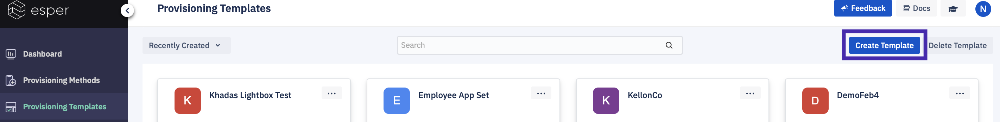

  

You have a choice to Create a Full Template or Create a Quick Template.

  

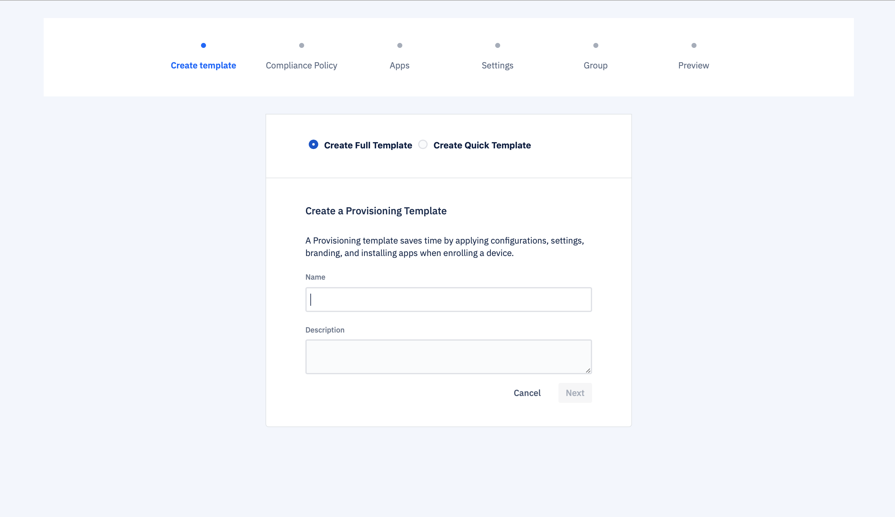

  

If you create a quick template, you simply enter a unique template name, select the application or applications to install when you provision the device along with Kiosk mode, then preview and save the template. Once you save the template you can go back and edit it at any time with the full template options.

  

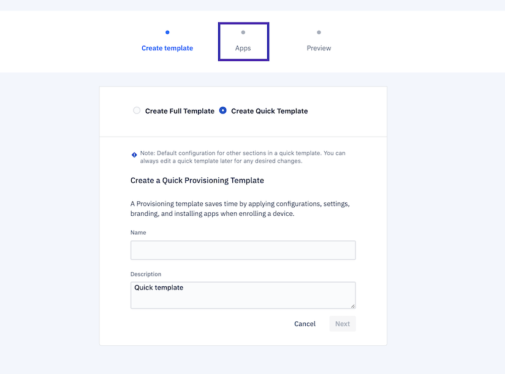

  

If you choose to Create Full Template, enter a unique name and an optional description for the Provisioning Template, then click **Next**.

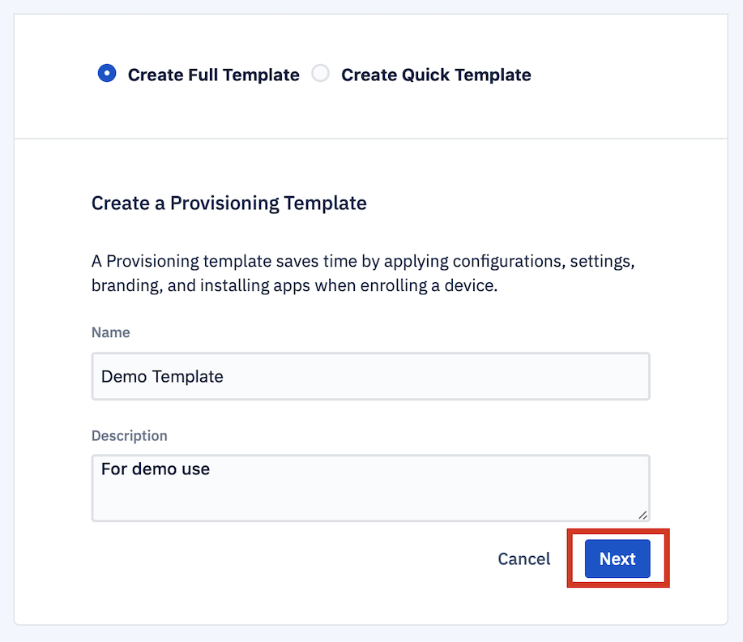

### Set up Compliance Policy Section in the Template

A Compliance Policy is a set of configurations or permissions that will be applied to all the devices provisioned through the template. Each configuration determines particular system behavior, in some cases including whether the device user is able to change a configuration on the device using the Android Settings application. This section lets you set the Compliance Policy that will govern all the devices provisioned using this template. You can change this after provisioning by defining a new Compliance Policy and then applying it to a Device or a Group.

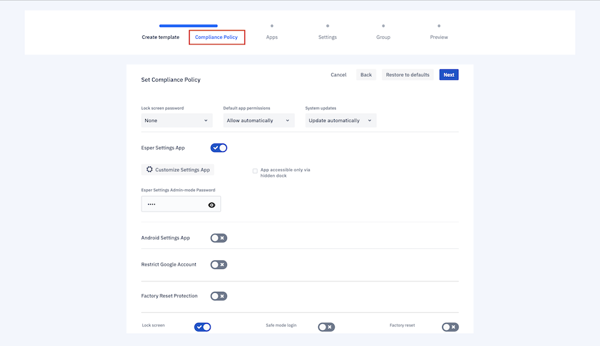

Hovering your mouse cursor over any item will give you a short explanation on-screen. Below is a detailed explanation of each of the configurations you can set in this section.

To learn more about individual settings in compliance policy check the link below:

**[How to create Compliance policy](../compliance-policy/create-policy.md)**

### Configure Apps Section in the Template

  

The Applications section lets you choose the applications you would like to have installed on your device during provisioning. You may choose to install Enterprise applications uploaded via the [Application Management](../apps/README.md) section of the Console or applications approved via [Play For Work](../apps/googleplaysignup.md) from your Managed Google Play Store account.

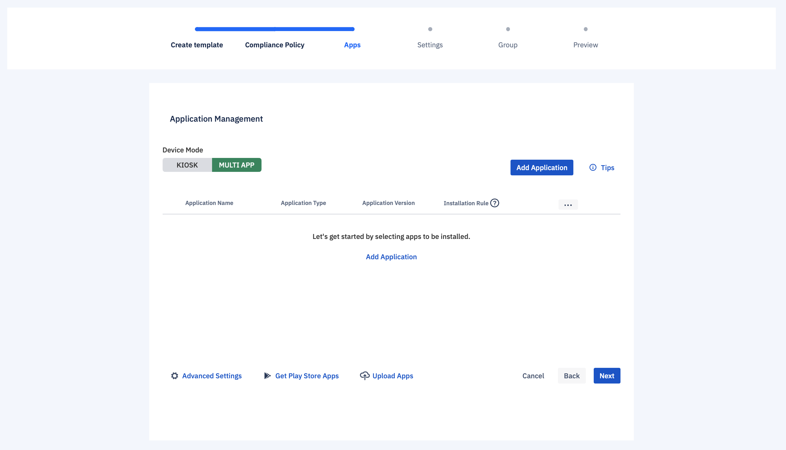

  

#### Switch Between Kiosk and Multi-app Modes in a Template

  

Once you click next Begin by clicking a radio button to choose whether you would like to provision your devices in either Kiosk Mode or Multi-Application Mode

  

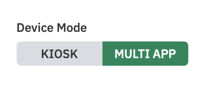

Kiosk Mode pins a selected Enterprise or Google Play Store application to the device unless the user exits kiosk mode. This is useful for cases in which the device will be used for a single purpose (for example, as an airport kiosk) and only the selected application needs to run on it.

:::tip
For an optimal Kiosk Mode implementation, other Compliance Policy configurations need to be properly set. See this [technical article](https://blog.esper.io/kiosk-on-esper) for more details.
:::

In Multi-Application Mode, the device user is free to use any Enterprise or Google Play application approved and installed using Esper.

#### Adding Applications for Installation to a Template

The 'Add Application' section gives you the ability to load any Enterprise applications and approved Managed Google Play applications onto the device when it is provisioned. These applications must have been previously uploaded to Esper as an Enterprise application through 'Apps' or previously approved through Managed Google Play.

Approved Managed Google Play applications will only appear if you have enrolled your endpoint in Managed Google Play. These applications must have been approved through Play for Work before they can be selected here. Simply find the Play store application you wish to install in the Get Play Store App, and it will be added to the list of applications. Once an Enterprise application has been uploaded into your Esper Cloud Endpoint, select it from the dropdown menu, then select the version, and click on 'Add' to add it to your template.

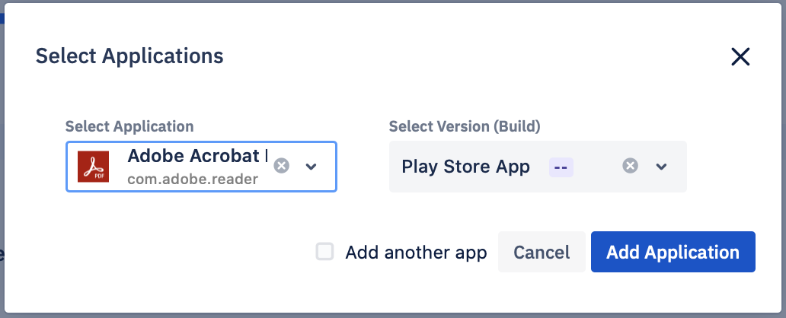

**Notes**:

1.  Before using a managed Google Play account, you need to set up a Managed Google Play account through Esper.
    
2.  If you include a Google Play Store application in your template but use it to provision a non-GMS device without support for Google Play, the application will not be installed when provisioned.
    

Once you click on the **Add Application** button you will see the applications listed.

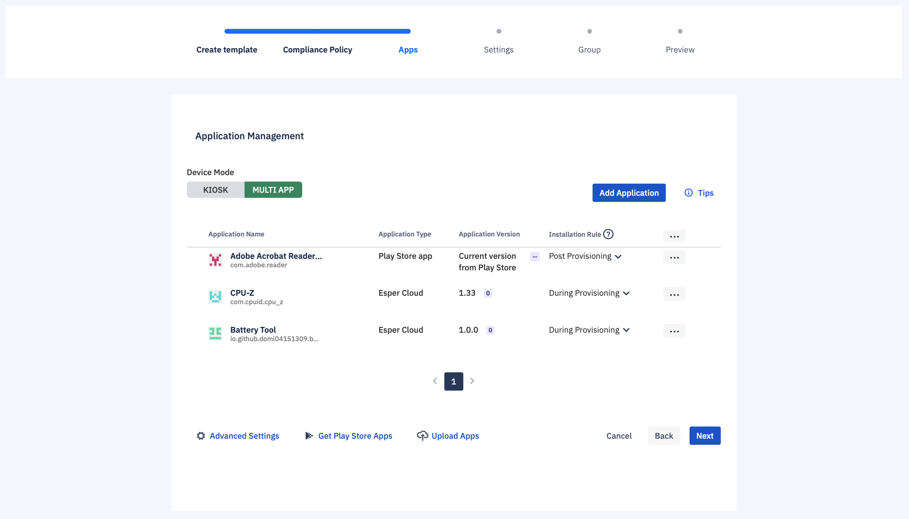

#### Installation Rule

Users can enable faster provisioning by choosing to install a given application during provisioning or afterward. For applications pinned on boot, the installation rule is set to during provisioning.

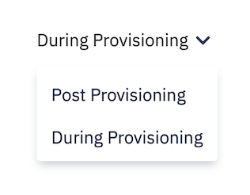

  

You can also choose from more actions if you want to clear the application from the list or wish to launch this application on the device when the device is turned on.

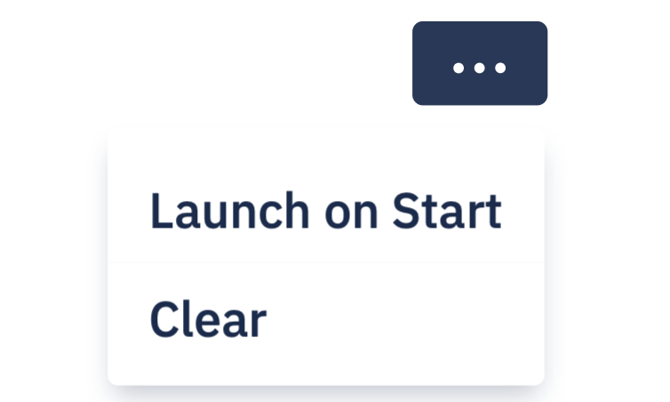

#### Advanced Settings

Clicking on Advanced Settings will launch a dialog box in which you can select either the Esper DPC Launcher or the default Android launcher.

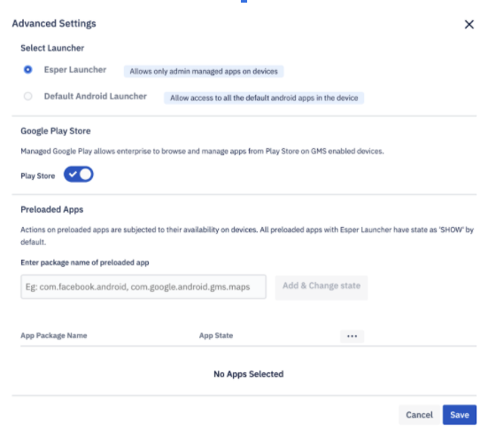

#### Choosing between Esper and Android launcher in a template

Most users will use the default setting: The Esper DPC Launcher. If you select Esper DPC Launcher, the Esper Device agent will take administrative control of the device, and only approved applications will be able to be installed or used. All the features of Esper Device agents will be functional. This gives you more control over the applications that can be used, and the actions that can be taken on the device.

If you select Default Android Launcher, the default Android launcher will be used. The device user will be able to exit the Esper Agent (DPC) as they would any other Android application. DPC will continue to run in the background and provide some device management, but many management features will not be available.

Specifically, the following features will be unavailable:

-   Capture Screenshot
-   Remote View and Remote Control
-   Over-the-Air OS updates for Esper Enhanced Android OS
-   Latest Device Agent updates for Devices running an Android version less than 6.0
    

The device screen will look and act much like a regular Android device, with the Esper Device Agent showing up as an app that can be opened and closed.

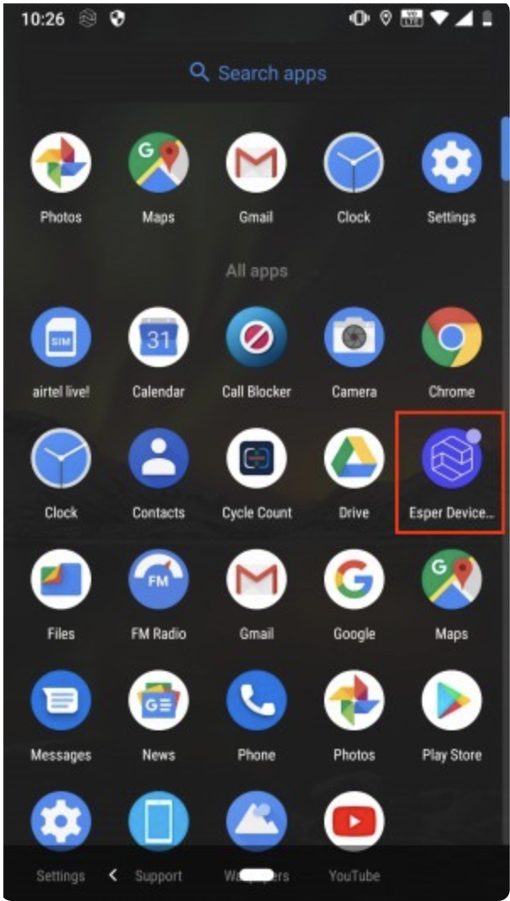

  

Even when the device user has exited Esper Device Agent, they‘ll be able to see it running in the background in the notification bar. This feature is for very specific use cases. If you are unsure whether you should use the Default Android Launcher please contact Esper.

There is also a checkbox that allows you to include or bypass Google Play setup during provisioning on GMS devices. If this is unchecked, the Google Play store will not be set up on the device, reducing provisioning time dramatically. If you have enrolled the device into a Managed Google Play account, the default value for this is set to On'; if the endpoint is not enrolled, then the default is 'Off'. It does not apply to Android Open Source Project devices that are non-GMS. Once you have made your selection, click Close.

#### How to Set the Application State of Preloaded Applications in the Template

  

Android devices normally come with a number of applications loaded onto them in ROM. The Preloaded Applications section enables you to select which of these will be available on the device after provisioning.

You can access the Advanced Settings section from Provisioning Template->**Apps**->**Advanced Settings**.

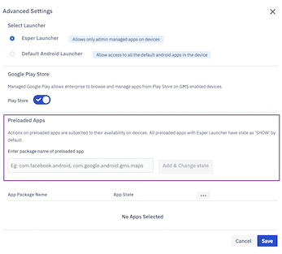

  

An Esper customer can explicitly set the Application state to “Show”, “Hide” or “Disable” after adding a preloaded application package as shown in the screenshot above.

In the field below the text “Enter package name of preloaded apps”, users may enter the package name of the applications which are pre-existing in the In-ROM memory of the device as packaged by the hardware manufacturer of the specific device.

:::tip
One easy way to find the package names is to provision one of your devices and then view the Preloaded Applications on that device. The package name for each application will be listed. You can also use ADB as well. You currently cannot set a Preloaded Application as the Kiosk mode application via a Provisioning Template, but you can do so at the Device level after the device has been provisioned.
:::

In this example screenshot, we have added packages “com.facebook.android”, “com.google.android.maps” and “com.chrome.android”. We have set the state of the application as “Show”, “Hide”, “Disable”. Show/Hide will simply either show or hide the preloaded application on the device screen.

By default, after provisioning an Android device on the Esper platform, the preloaded applications are being hidden. By using this section, users may choose to show them. The “Disable” feature lets the IT Admin prevent the application from functioning unless chosen otherwise.

The feature to disable preloaded applications is also available via 'Device Settings' as well as during the Device Provisioning process via this section in the Template.

#### Approve and Disapprove Google Play Applications in the Templates

  

The 'Play Store Applications' section of the 'Your Applications' tab gives you the ability to load approved apps from the Google Play Store onto the device as it is provisioned. This section will only appear if you have enrolled your endpoint in [Managed Google Play]. These apps must have been approved through Play for Work before they can be selected here. Click on the approved Play Store application you wish to install, and it will be added to the list of applications.

  

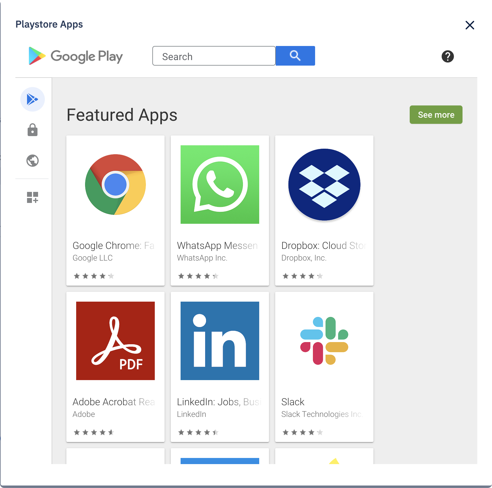

  
:::tip
If you include a Google Play Store application in your template but use it to provision a non-GMS device without support for Google Play, the application will not be installed when provisioned.
:::

### Apply Device Settings in the Template

The Settings section lets you determine levels for most of the device settings: These include things like screen brightness, wallpaper, alarm volume, and screen timeout. You can also set up devices with Wi-Fi credentials, along with determining the duration of an ADB session if ADB was enabled in the Compliance Policy section.

  

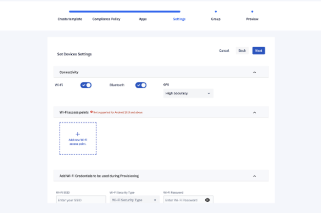

  
 

:::tip
If the Android Settings Application is enabled for a device in Multi-application mode, the device user can access these settings and change them on the device.
:::

You can set the language for the device under ‘Device Language’ while creating or editing a template but the language will be implemented when using the 6 tap QR code method or the Android For Work (AFW) method.  

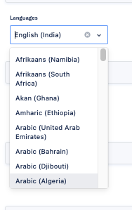

:::tip
The device language cannot be set post-provisioning. This language setting will not be applied when provisioning the device using the device provisioner or seamless provisioning. 
:::

To learn more about individual setting details check the link below:

  

**[Managing and controlling settings for a single device](../devices-groups/device-settings.md)**

#### What are Extra Settings for Android?

Enable JSON setting when On, lets you input a vaild JSON code. 

```
{
"dpc_params": [
{"key": "hideEsperIcon",
"value": "true"}
]
} 
```

For default Android Launcher, if set true, the Esper app icon will be hidden on the device. To make it visible you need to set it false under template and reprovision device with that template.


:::tip
 This config will only work in template (pre-provisioning state) because setting launcher is set at boot time.
:::


### Link a Device Group to a Template

  

Whenever you use any template Qr code to provision a device, this group liking will determine where that device will be positioned in the Esper platform. So users can assign a group to where they wish to have it later post provisioning.

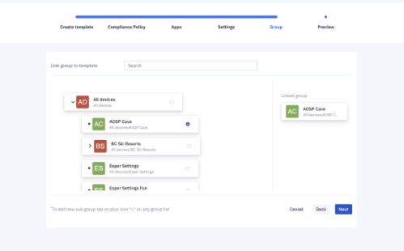

### Preview

The Preview section gives you a preview of the entire Provisioning Template. If you wish to edit any settings, use the Back button to go back to the appropriate screen.

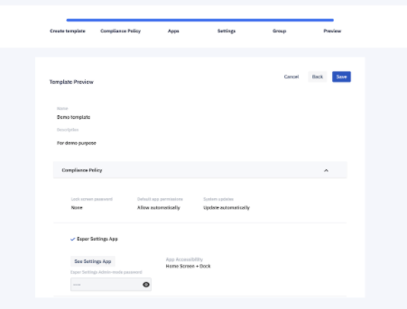

  

When you are satisfied with your template, click **Save**. You will see a pop-up to confirm your settings. Click **Okay**. If you are creating a new template and select **Cancel**, the system will discard the template you are creating; if you’re editing an existing template, the system will discard any changes made to the template.