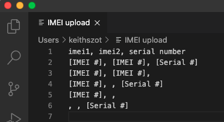
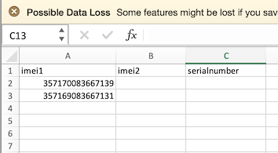
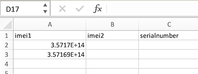
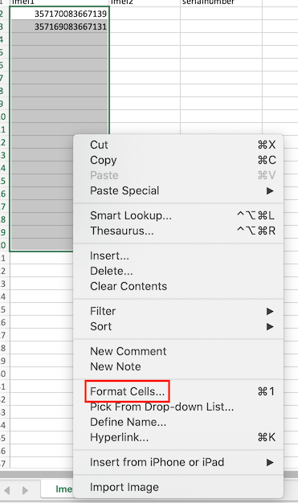
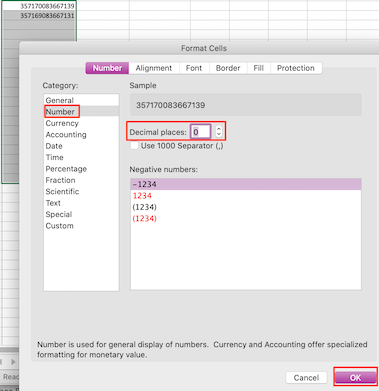
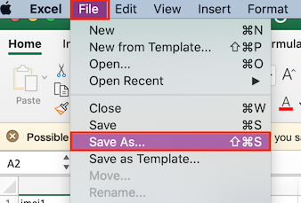
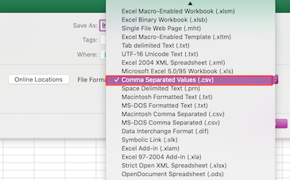

## How to Upload Multiple IMEI/Serial Numbers to a Template for IMEI Provisioning?

To upload a set of IMEI/Serial Numbers for devices you want to provision using Android for Work, or for Esper Enhanced Android devices with this template, click Upload IMEI CSV. The CSV file containing the IMEI and serial numbers must adhere to the following conditions:

-   The CSV requires the first entry of "IMEI1, IMEI2, serial number".
    
-   Then on each cell below enter "[IMEI #], [IMEI #], [Serial Number]".
    
-   If you don’t want to add a second IMEI or serial number, leave the space blank between the commas
    
-   Thus if you are entering just IMEIs, you can make each row either "[IMEI #], [IMEI #]," or "[IMEI #]," or "[IMEI #]".
    
-   If you are entering just serial numbers, you can make each cell ", , [Serial #]".
    
-   The comma separation is required.
    
-   The IMEI numbers need to be valid 15-digit numbers; IMEIs are being validated through Luhn’s algorithm.
    
-   The file should not be empty.
    
-   Don’t list more than three values in a single row.
    
-   Don’t upload duplicate IMEIs.
    
-   Don’t switch the order of IMEI and serial numbers.
    
-   Any time a CSV is uploaded, the previous IMEIs and Serial Numbers for that template will be deleted and replaced by the new additions from the CSV. This will not impact any devices that have already been provisioned.
    

The example below is using a text editor to create the CSV file:

If you are using a spreadsheet program instead of a text editor, each field goes into three consecutive columns by row.

See the example below using Excel:

If you only have IMEIs, you can copy and paste them into the first column after the header row. If you are using only serial numbers, copy and paste them into the third column after the header row. Note that Excel’s default cell format is General which will turn an IMEI into an Exponential causing an error when uploading.

To prevent this the cell range must be properly formatted before the data is copied over. Start by selecting the cell range where the data will be copied to. The right-click to bring up the options for the range, and select Format Cells:

Now select Number, and then set the decimal places to 0. Click OK

If the list is just serial numbers, copy them to the third column (C) underneath the first row. If Serial Numbers are numeric-only you may encounter the exponential problem requiring formatting the cell range as described for IMEI.

However, if the serial number starts with 0, Excel will automatically remove the preceding and any following 0s. To prevent this from happening you need to append an ' in front of the number. If the serial number is alphanumeric, you should have no problems with the default cell formatting.

Finally, remember to save the file as CSV. Do this by choosing File | Save As…

And then choose the file type of CSV, then save the file.

You can use either the IMEI or serial number for a particular device. As cellular devices will have both an IMEI and serial number, or in some cases have two IMEIs (dual SIM) and a serial number, the Esper system follows a particular order when processing a new device for IMEI-based provisioning:

-   IMEI 1
    
-   IMEI 2
    
-   Serial Number
    

This means if you added IMEI 1 to Provisioning Template 1, IMEI 2 to Provisioning Template 2, and serial number to Provisioning Template 3, then Esper will provision the device according to Provisioning Template 1. 

If you have already added an IMEI or serial number to a provisioning template and try to upload it again to another provisioning template, Esper will not use the uploaded CSV and will return a toast error message in the lower-left corner of your screen.

You can also upload a CSV or individually add IMEIs and Serial Numbers when [editing a template](https://docs.esper.io/home/console.html#provisioning-templates).