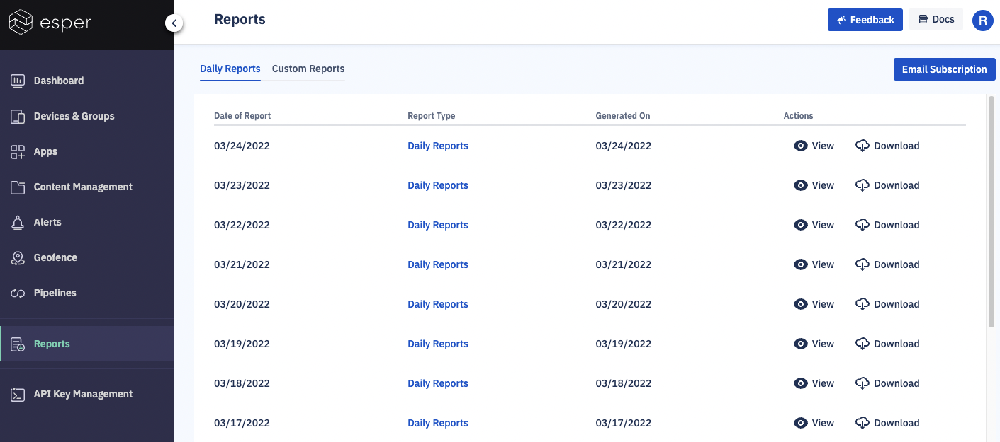

## What are Reports? 

Your Esper Console provides reports on device and group performance. The Reports section explains how these reports work and how to customize these reports.

The reports can also be downloaded as a .pdf file, an Excel spreadsheet, or a .csv file by clicking the Download icon and selecting a file format from the dropdown menu.

