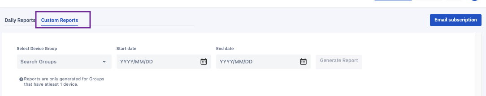
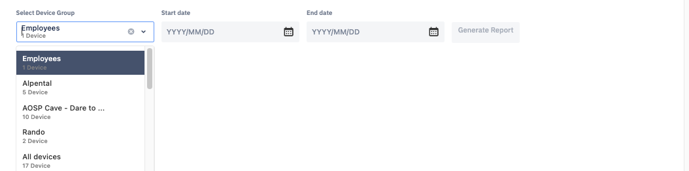
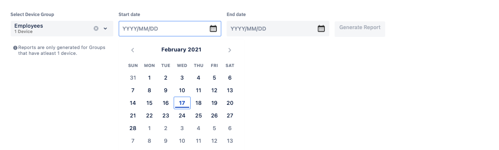
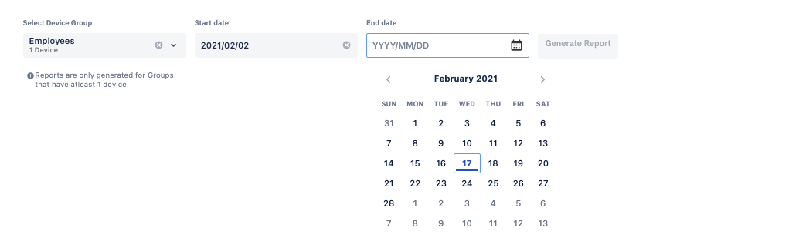
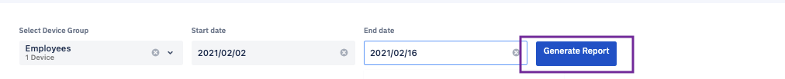
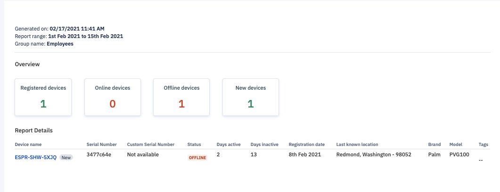

## How to Generate a "Custom Reports"?

  

You can generate a custom reports for a specific period of time.

Step 1: To generate a custom report, navigate to the 'Custom Reports' tab.

  

  

Step 2: Select the device group for which you wish to generate reports.

  

Step 3: Select the start date from where you want to generate reports.

  

  
  

Step 4: Select the end date up to which you wish to generate reports.

  

  

Step 5: Click **Generate Report**.

  

Step 6: Your report will be generated.

  

