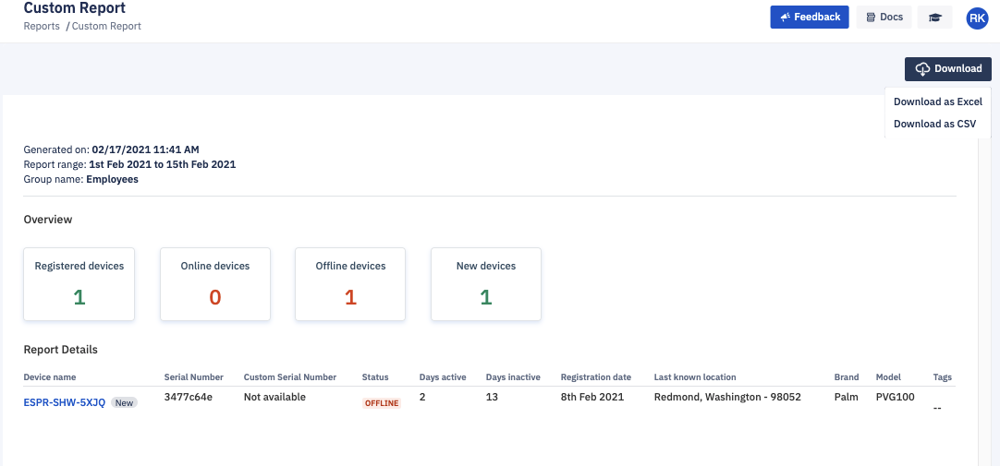

## How to Download Custom Reports?

  

Users can also download the custom reports in the format of PDF, Excel, or CSV. To download the report click on the download option on the top right corner of the custom reports screen. 

Your report will be downloaded to your system.

  

**Note**: Report download may take a while depending on the number of devices.