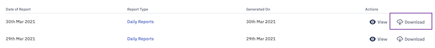
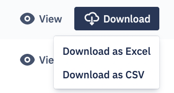

### How to Download a "Daily Report"?

Navigate to the Report section. Inside the 'Daily Report' tap, click the Downolad icon under the Actions. 

The reports can be downloaded as an Excel spreadsheet, or a .csv file. Choose the required option from the dropdown.

 A daily report will be downloaded on your local computer.