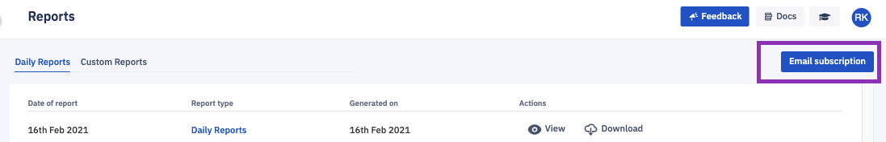
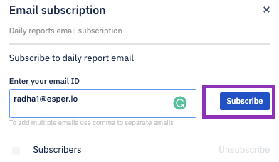

## How to Enable Email Subscription for Daily Reports?

  

You can subscribe via email to automatically generated system reports. To subscribe, click the **Email Subscription** button at the top right of the Reports window.

  

  
  

The Email subscription pane slides in from the right. Enter user email addresses in the Enter your email ID field. You can enter multiple email addresses into this field, just use commas to separate them. Click **Subscribe**.

  

There are some limitations to the report email subscription service:

-   A maximum of ten subscriptions can be created for each endpoint.
    
-   Duplicate email addresses are not allowed.
    

All subscriptions will be subject to an automated check for invalid email address format and invalid domain.