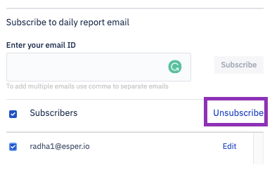
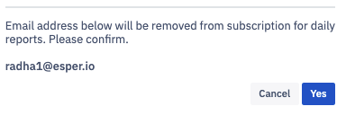

## How to Unsubscribe Email from the Daily Report?

To unsubscribe users from the daily report email, click on the checkboxes next to the email address in the Subscribers list and click Unsubscribe. You can unsubscribe all email addresses by selecting the Subscribers checkbox at the top of the list and clicking **Unsubscribe**.

You will see a pop-up to confirm your unsubscription. Clicking **Yes** will unsubscribe the user. Clicking **Cancel** will take you back to the email subscription slide-out.

  

