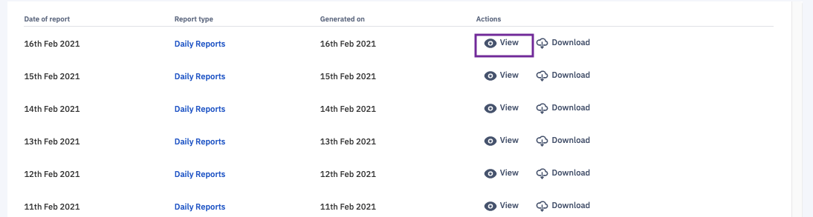
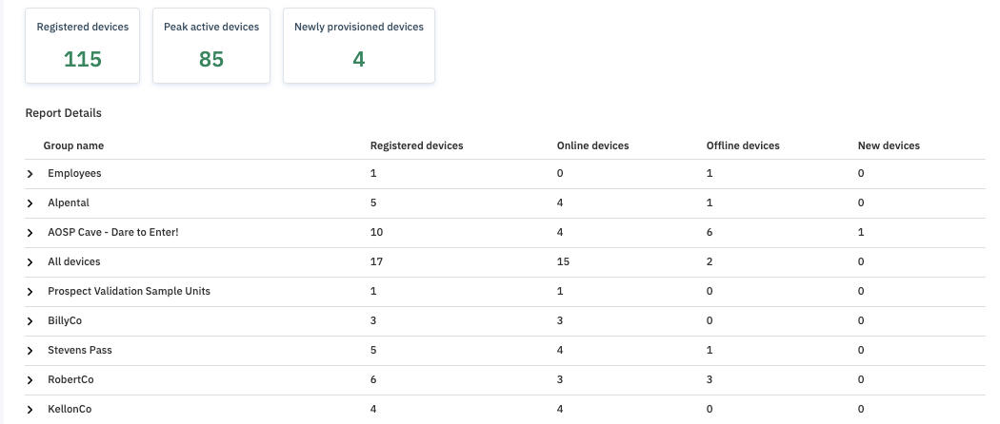
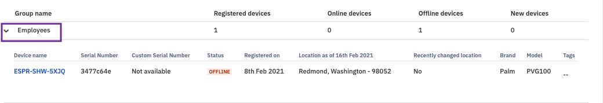
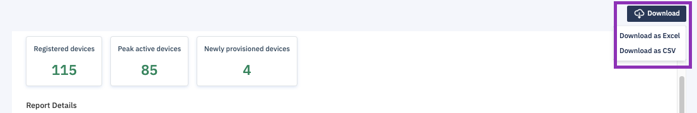

## How to View Daily Reports?

Esper automatically generates a daily report for your fleet. The Reports section lists available Daily Reports. The most recent reports are filed at the top of the list. To view a Daily Report, click the View icon or click Daily Reports under Report type.

This information can also be downloaded as a .pdf file, an Excel spreadsheet, or a .csv file by clicking the Download icon in line with its listing and selecting a file format from the dropdown menu.

The Daily Report lists the following information:

-   Number of registered device or devices provisioned on your endpoint
    
-   The peak number of active devices
    
-   Number of the newly provisioned devices or the last 3 days provisioned devices
    

For each device group, it also lists:

-   Number of Registered devices
    
-   Number of Online devices
    
-   Number of Offline devices
    
-   Newly provisioned devices
    

Clicking > next to one of the groups will give you additional detail about the devices in that group.

The additional details view offers the following data for each device:

-   Device name
    
-   Serial number
    
-   Status
    
-   Registration date
    
-   Location on the report date
    
-   Recent changes to device location
    
-   Brand
    
-   Model
    
-   Any tags assigned to the device
    

  
  

This information can also be downloaded as a .pdf file, an Excel spreadsheet, or a .csv file by clicking Download and selecting a file format from the dropdown menu.

