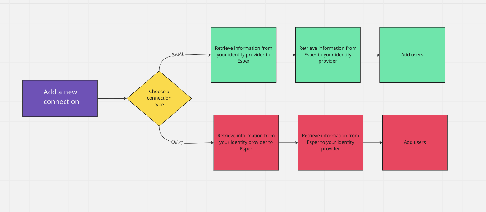
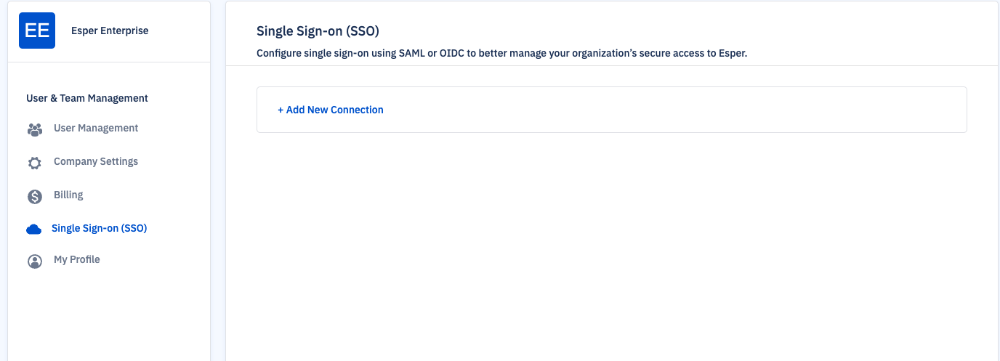
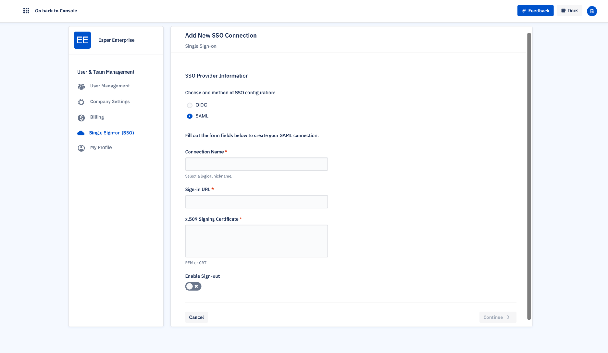
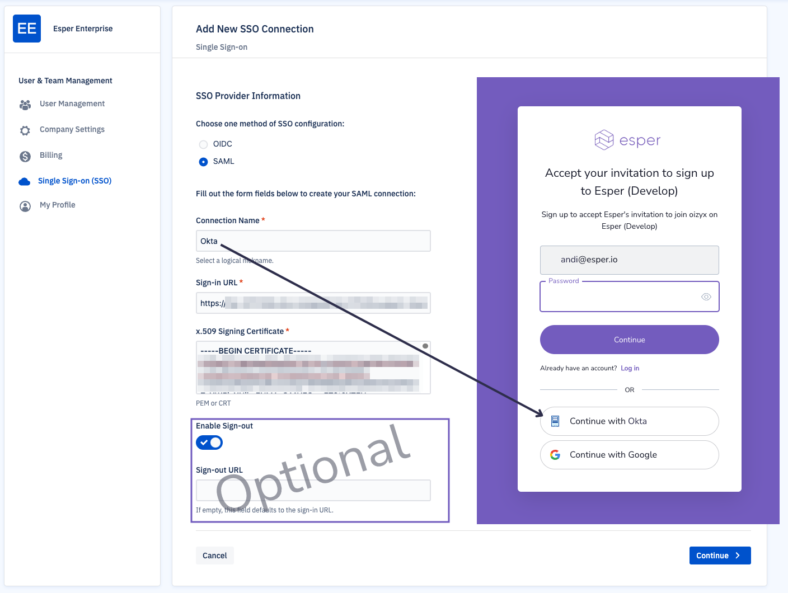
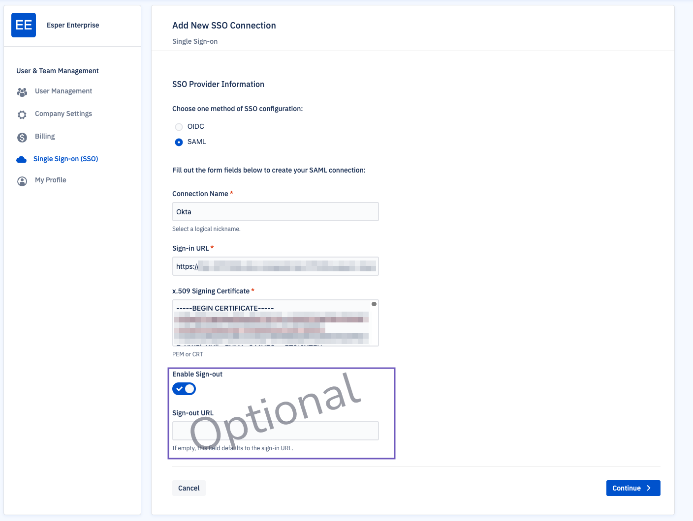
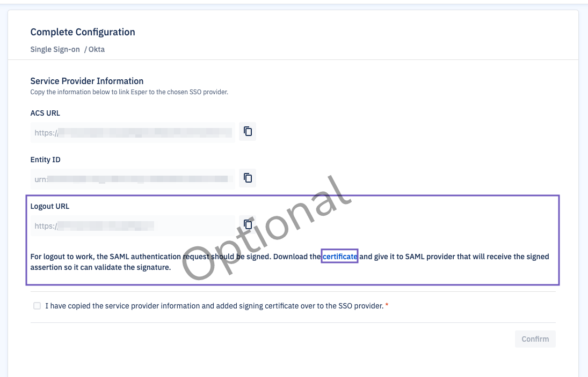
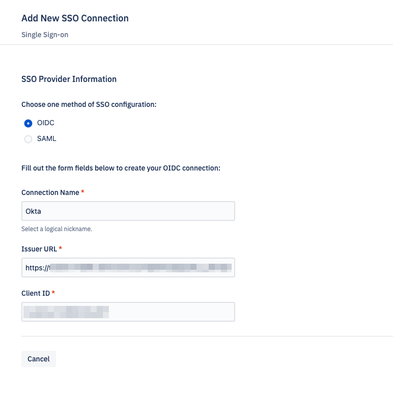
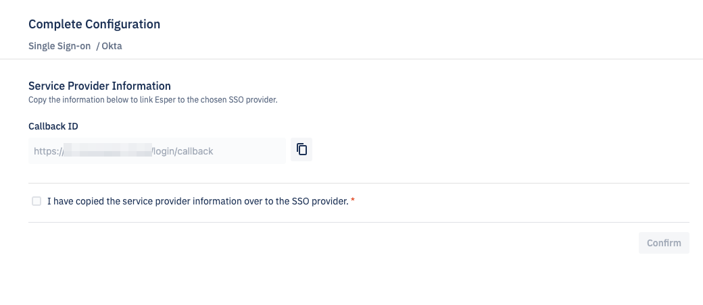
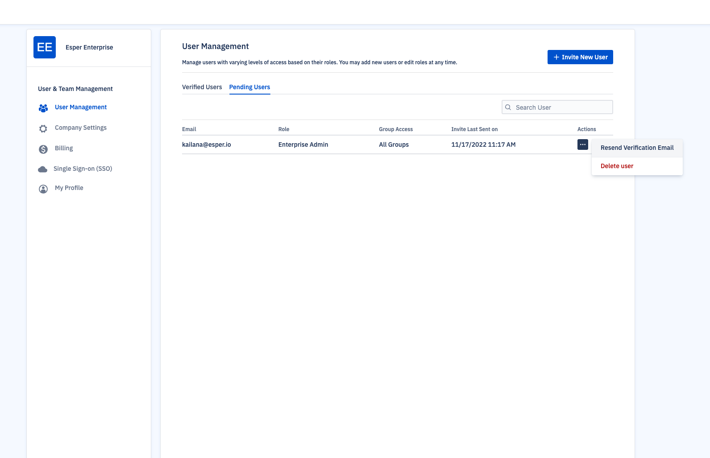
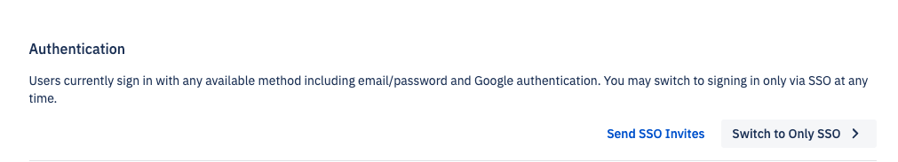

# How to Set Up Single Sign-on (SSO)?

Some organizations may have security needs that go beyond traditional sign-in methods. This article covers the setup process for Security Assertion Markup Language (SAML) or Open ID Connect (OIDC). SAML is one option for organizations that want to enable single sign-on for browser-based applications. OIDC also offers lightweight performance for sign-on. Esper supports both, but only one method may be used at a time. 

Not every organization will need SSO. Before setting up the sign-on experience, choose an identity provider and method that works best for your organization.

**To access SSO setup, you will need the following:**
- Enterprise Administrator access to the Esper console 
- Administrative access to an identity provider (for example, Okta)

**In this article:**
- SSO Setup Process
- Setting Up SAML 
- Setting Up OIDC
- Adding Users
- Deleting a Connection

## SSO Setup Process 

The SSO setup process consists of: 
- Adding a new connection in Esper 
- Choosing a connection type: SAML or OIDC 
- Providing Esper information to the identity provider 
- Providing identity provider information to Esper 
- Adding users

## Setting Up SAML

**Step 1** Adding a New Connection

To add a SAML SSO,  click on your profile section and select “Single Sign-on (SSO)”. Then press **‘+Add New Connection’**. 

Choose “SAML” as your SSO configuration. 

Use the identity provider as the Connection Name. The Configuration Name will be the name users see as an option before logging in.

**Step 2** Configuring SSO for Esper

Next, log in to your identity provider. You may need to create a new app. Ensure you have the following:
- Identity provider Single Sign-On URL 
- X.509 Certificate 
- Optional: A sign out URL

Back in Esper, input these credentials to their respective fields.

:::tip 
Should you provide a sign-out URL?
Most organizations will not need a sign-out URL, also known as a single logout (SLO). Use SLO only if you want to log out the user from Esper as well as your identity provider when they sign out of Esper. 
:::

If you are setting up SLO, turn on the ‘Enable Sign-out’ option. 

Then, press **Continue.**

Copy the ACS URL and Entity ID to a secure document. If you are setting up SLO, copy the Logout URL and download the certificate as well.

**Step 3** Configuring SSO in the Identity Provider

Go back to your identity provider. Change the following information: 
- Input Esper’s ACS URL into the sign on URL field
- Input Esper’s Entity ID into the Entity or Audience UI 
- Select “Email Address” for Name ID format
- Optional: Logout URL 
- Optional: Esper Sign-out Certificate

On the “Complete Configuration” screen, you’ll be asked to provide information to your service provider. Copy the ACS URL and the Entity ID and paste it into the relevant fields for your service provider. 

Once you’ve entered the information, click the checkbox and press **Confirm**. 

<mark>Once you’ve configured SSO, you’ll need to add users. See Adding Users for more information. </mark>

## Setting Up OIDC 

In your identity provider, create a new application and choose OIDC and single-page application. 

The grant type should be “Implicit (hybrid).”

Once you’ve set up an OIDC app in your identity provider, copy the following credentials: 
- Issuer URL. Learn more about Issuer URLs [here](https://developer.okta.com/docs/reference/api/oidc/#well-known-openid-configuration).
- Client ID

**Step 1** Add a New Connection

To add an OIDC SSO,  click on your profile section and select Single Sign-on (SSO). Then click on **+Add New Connection**. 

Choose OIDC and name the connection. 

Then, insert the Issuer URL and the Client ID from your identity provider.

Press **Continue**. 

In the “Complete Configuration” screen, you will receive a Callback ID. 

Go back to your identity provider and input this ID in the sign-in redirect URI Then press **Confirm**.

<mark>Once you’ve set up the SSO configuration, you’ll also need to add users to Esper and your identity provider.</mark>

## Adding Users to SSO

After configuring SSO, you’ll need to add users to both your identity provider and Esper. 

In your identity provider, assign users to the Esper application. 

In Esper, select your profile and select User Management. Add a new user by pressing ‘New User’.
 
Enter their information and press **Continue**, then select their access privileges and press **Invite**. The user will receive an email to sign up to the Esper tenant.

Until they accept the invitation, the user will appear in the Pending tab. Invitations may also be deleted from this tab. 

If you’d like to resend an invitation, the old link will expire and the new link will be valid for 24 hours.

Once SSO is configured, you may also choose to send SSO invites to have users.

::: warning
We recommend testing that your SSO is working as expected *before* selecting “Switch to Only SSO.”  At least one administrator should have accepted the SSO invite and have the credentials to log in before marking this option. Other login methods will be disabled.
:::

Select "Switch to Only SSO" *only* after users have accepted their SSO invites. 

### Have existing users that you’d like to convert to SSO? 
You will need to invite them after configuring your SSO. After configuring SSO, and adding users in Esper and your identity provider, select “Switch to Only SSO.” Users will now *only* be able to sign in using the provisioned SSO method. 

If you would like users to only log in via SSO, you should delete other credentials after users accept their invitations. 

### How to Accept the SSO Invite 

Invited users will receive an invitation in their inbox. Once they click on the invitation link, they should choose the SSO login method. Choosing another login method (such as password or Google) will not satisfy the SSO criteria. 

