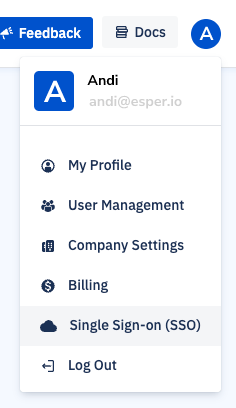
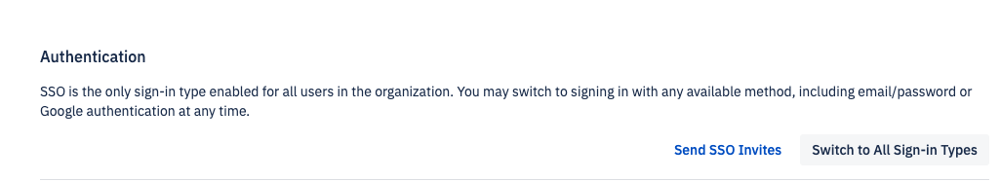

## Deleting an SSO Connection

You may delete an SSO connection with an identity provider at any time. However, there are a few things to keep in mind before deleting one. This article provides the steps on how to delete a connection and what that means for users currently using SSO.

**In this article:**

*   What Happens When I Delete a Connection?
*   Deleting a Connection

What Happens When I Delete a Connection?
----------------------------------------

When you delete an SSO connection, all users using that sign-on method will no longer be able to log in. We recommend ensuring that users have a non-SSO sign-on method available before deleting a connection.

Deleting an SSO connection also means that your users will need to use Google Sign-in or email address and password to log in.

Deleting a Connection
---------------------

**Step 1: Switch to All Sign-in Types**

Before deleting an SSO connection, an administrator will need to log in with a non-SSO method (such as email/password or Google Sign-in. If the tenant allows only SSO, it will need to be switched to "All Sign-in Types". 

To switch to all sign-in types, go to your user profile, and select Single Sign-on (SSO). 

Then, click on **Switch to All Sign-in Types**.

Once switched, log in with a non-SSO method (email/password or Google Sign-in).

**Step 2: Delete the Connection**

Then, navigate back to the Sign-Sign-on (SSO) section in your user profile. You will now be able to delete the SSO connection. 

Then, click on **Delete Connection.** 

Type **DELETE** and press **Confirm**.

All users that signed in through SAML or OIDC will have their accounts disabled and will no longer be able to use the SAML or OIDC method to log in. This process can take about 10 minutes.

Be sure to delete or reset the app in your identity provider as well.

Users will not be deleted from the system, as administrators may still want to access their logs after deactivating SSO. If you’d like to delete a user, click on “User Management” > “Actions” > “ellipses (…)” > “Delete User”.