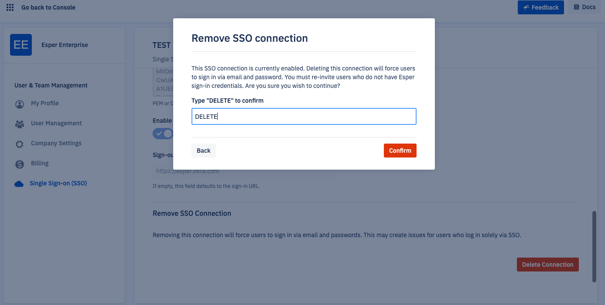

# How to delete an SSO connection? 

**In this article:**
- What Happens When I Delete a Connection? 
- Deleting a Connection 

## What Happens When I Delete a Connection? 

When you delete an SSO connection, all users using that sign-on method will no longer be able to log in. We recommend ensuring that users have a non-SSO sign-on method before deleting a connection. 

## Deleting a Connection 

::: warning
Once a connection is deleted, users will no longer be able to sign in using the SSO method. Ensure users have an alternate method before deleting. 
:::

To delete an identity provider, select your profile icon, click on Single Sign-on (SSO), and scroll to the bottom of the SSO set up page. Press **Delete Connection**. 

Type DELETE and press **Confirm.**

All users that signed in through SAML or OIDC will have their accounts disabled and will no longer be able to use the SAML or OIDC method to log in. This process can take about 10 minutes. 

Be sure to delete or reset the app in your identity provider as well. 

Users will not be deleted from the system, as administrators may still want to access their logs after deactivating SSO. If you’d like to delete a user, click on “User Management” > “Actions” > “ellipses (…)” > “Delete User.” 
