# How to Set Up OIDC in Okta?

This guide provides steps for setting up OpenID Connect (OIDC) for the Esper console using the Okta identity provider. 

**To access SSO, you will need the following:**
- Enterprise Administrator access to the Esper console 
- Administrative access to Okta

**In this article:**
- Do I Need OIDC SSO? 
- Creating an OIDC Integration in Okta 
- Setting Up OIDC in Esper 
- Granting Access to Users

### Do I Need OIDC SSO? 

Not all organizations will need OIDC SSO. Other methods, such as email and password, are available in Esper. 

### Creating an OIDC Integration in Okta 

**Step 1 Creating an Esper App in Okta**

Log in to an Okta account with administrative access. Go to the Applications tab, and select **‘Create App Integration’**. 

Choose “OIDC” and “Single-Page Application.” 

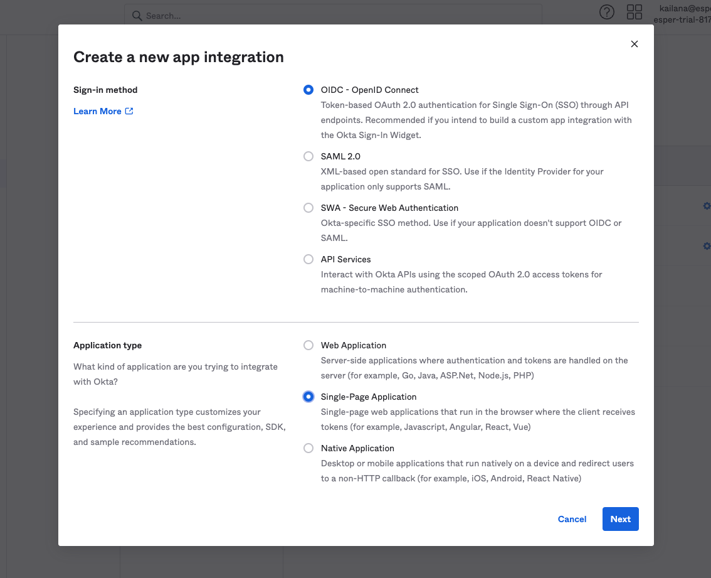

Then press **Next**. 

On the next screen, name the integration and optionally upload a logo.  

For Grant type, choose “Implicit (hybrid).” 

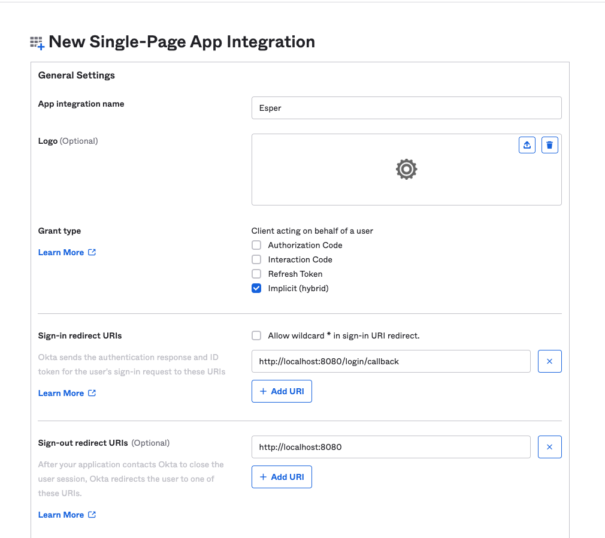


You might notice that the “Sign-in redirect URI” points to a localhost URI. We will update this in Step 2.

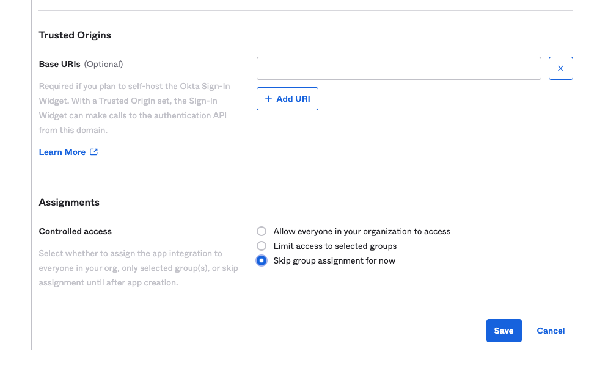

Leave the Controlled access as “Skip group assignment for now.” It may be updated later. Then press **Save.** 

On the next screen, copy the Client ID to a secure document. 

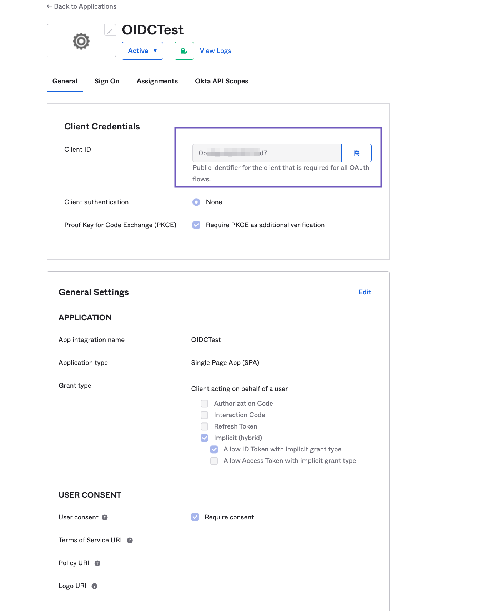

### Setting Up OIDC in Esper 

**Step 2 Setting Up a Connection for OIDC** 

To add an OIDC SSO,  click on your profile section and select Single Sign-on (SSO). Then click on **+Add New Connection**. 

Choose OIDC, and name the connection. 

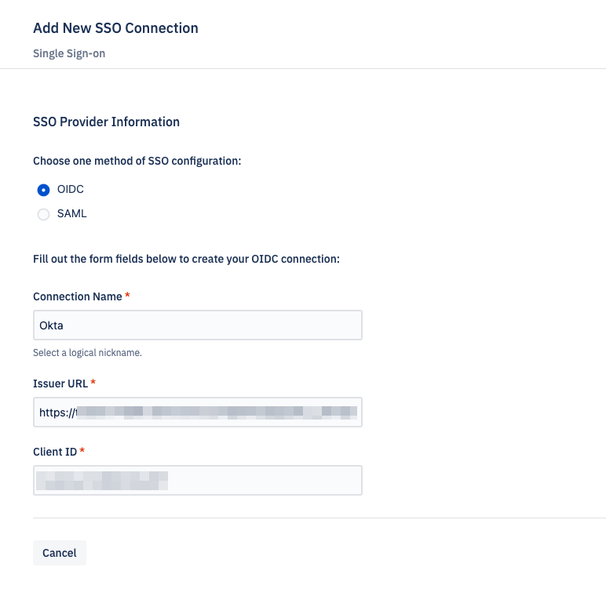

Then, insert the “Client ID” from Step 1. 

Your [Okta Issuer URL](https://support.okta.com/help/s/article/What-is-theIssuerlocated-under-the-OpenID-Connect-ID-Token-app-settings-used-for?language=en_US#:~:text=By%20default%2C%20the%20Issuer%20is,auth.oktaice.com%20) will look something like this: 

```https://{yourOktaOrg}/.well-known/openid-configuration?client_id={ClientId)```

Press **Continue.** 

Copy the "Callback ID".

**Step 3 Adding OIDC Credentials** 

In Okta, go to the application and **Edit** the General Settings section. 

Input the Callback ID from Esper into the “Login” > “Sign-in redirect URI.” 

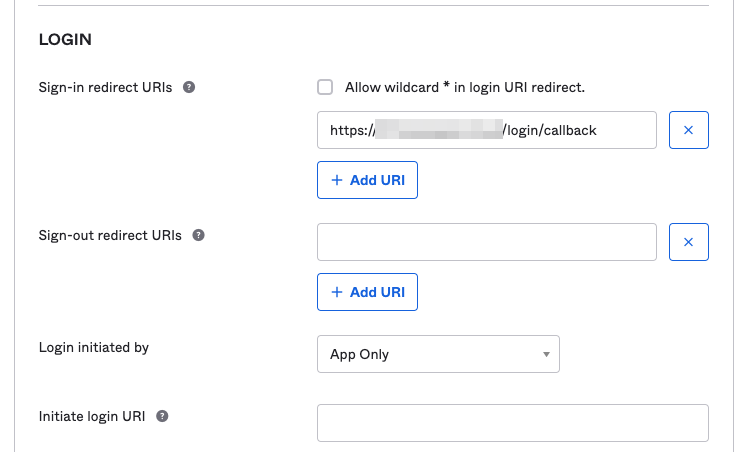

Then press **Save**. 

Back in Esper, select the checkbox “I have copied the service provider information over to the SSO provider.” 

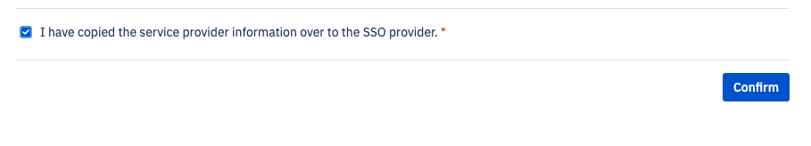

Then press **Confirm**. 

Once you’ve set up OIDC SSO, you’ll also need to add users to Esper and Okta. 

**Step 4 Granting Access to Users**

You’ll need to add users to both Esper and Okta so they can successfully log in. 

In Okta, under the app’s Assignments tab, select “Assign” > “Assign to People.” 

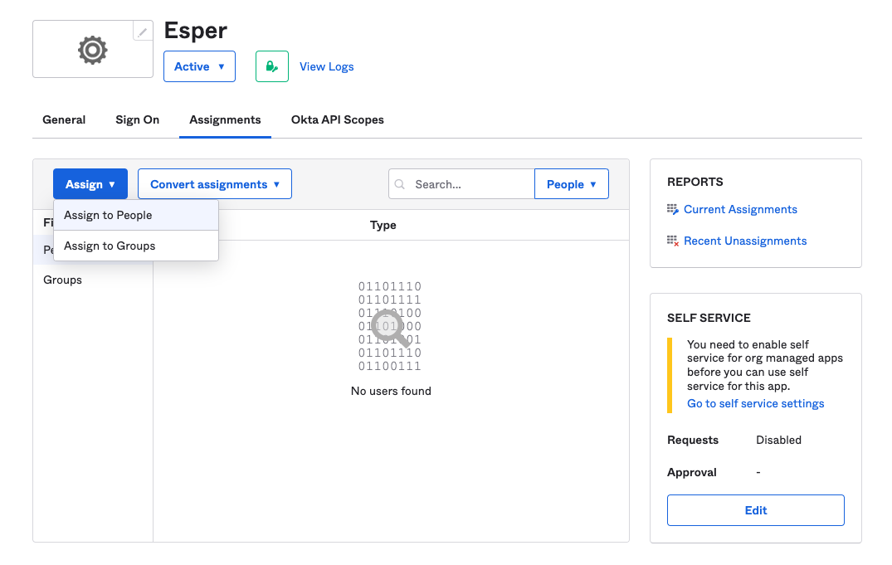

Locate the users you want to assign. and press **Assign** next to their names.  You will need to use the same email addresses in Okta as you do in Esper.

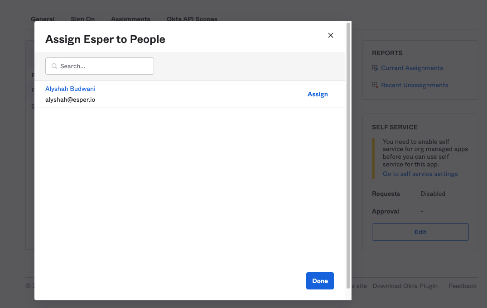

Once you’ve assigned the users, press **Done**. 

In Esper, you may invite users by clicking on the “Send SSO Invites.” This option becomes available once you’ve set up SSO. 

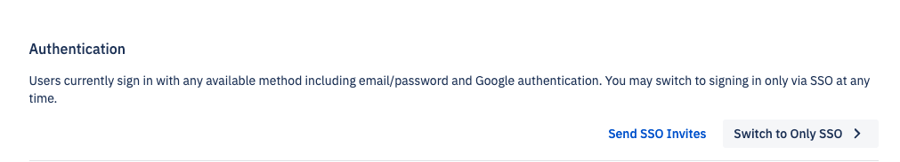

If you’d like to “Switch to Only SSO,” be sure that at least one user has successfully logged in using SSO. 

::: warning
You may be locked out of the account if you select “Switch to Only SSO” without having a user who has logged in using SSO previously.
::: 

You may also invite users via User Management. 

## How to Accept the SSO Invite 

Invited users will receive an invitation in their inbox. Once they click on the invitation link, they should choose the SSO login method. Choosing another login method (such as password or Google) will not satisfy the SSO criteria. 

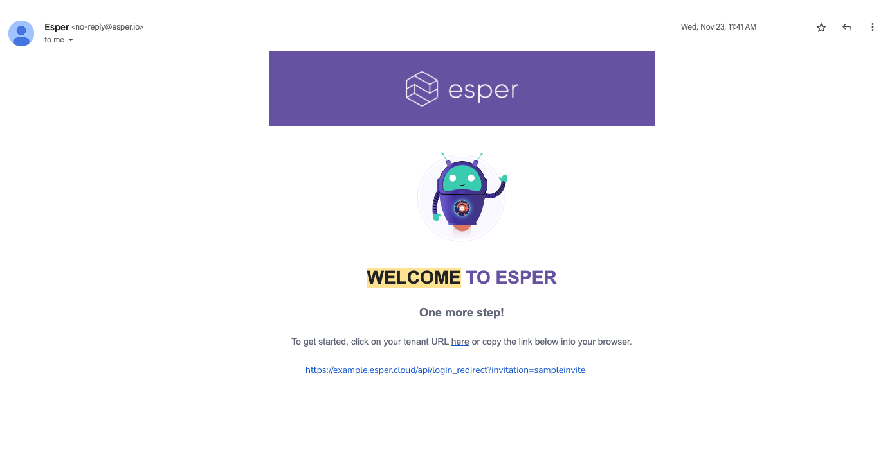
